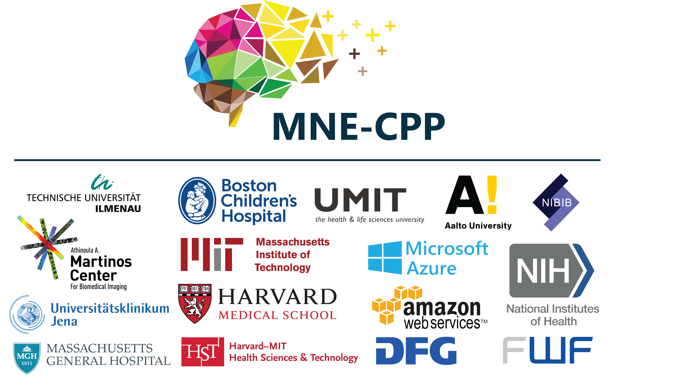

---
title: Home
has_children: true
nav_order: 1
---

# The MNE-CPP Project

MNE-CPP is a cross-platform, open-source framework which offers a variety of software tools to the neuroscientific research community. We provide applications for the acquisition and processing of MEG/EEG data, both in real-time and offline. All applications are built on top of our cross-platform library which is available via an API and can be used to develop new tools.