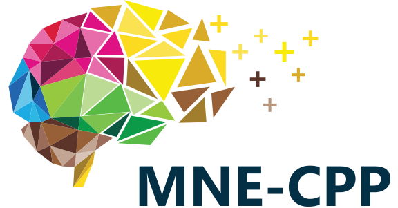

&nbsp; &nbsp; &nbsp; &nbsp; &nbsp; 

MNE-CPP is an open-source software suite which offers a wide variety of neuroscientific tools. We provide a cross-platform library which allows the processing of MEG and EEG data, as well as standalone MEG/EEG applications for clinical use, acquisition, real-time processing, and data browsing.

First time? [Click here](pages/started.md) to get MNE-CPP running on your machine.

Stable release coming soon.
