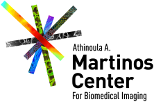

<html>
   <footer class="footer">
   

      
              
      
      
      
            
      
      
      
      
   

   </footer>
   
</html>

MNE-CPP is a cross-platform, open-source framework which offers a variety of software tools to the neuroscientific research community. We provide applications for the acquisition and processing of MEG/EEG data, both in real-time and offline. All applications are built on top of our cross-platform library which is available via an API and can be used to develop new tools.