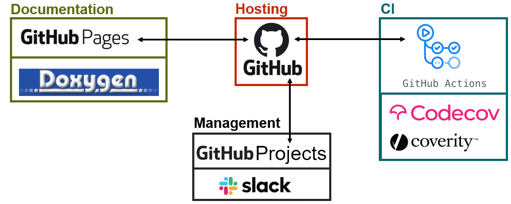

# Contribute

&nbsp; &nbsp; &nbsp; &nbsp; &nbsp; &nbsp; &nbsp; &nbsp; 

We use a variety of different tools to develop and maintain MNE-CPP. We use [Github](https://github.com/mne-tools/mne-cpp) to host the source code for MNE-CPP. Continuous integration tools are provided by [GitHub Actions](https://github.com/mne-tools/mne-cpp/actions), [Codecov](https://codecov.io/gh/mne-tools/mne-cpp) and [Coverity](https://scan.coverity.com/projects/mne-tools-mne-cpp). For communication and project management we use GitHub Projects as well as [Slack](https://mne-cpp.slack.com/). MNE-CPP's API documentation is realized with [Doxygen](http://www.doxygen.nl/).

Please [contact us](../../team.md) with any questions you may have.
