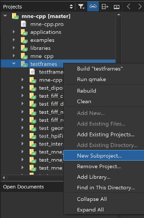

# Unit Test

As already mentioned in the coding conventions, we require unit tests for newly added functionalities. Hereby we focus more on functional testing instead of high code coverage. Writing a test usually helps oneself to completely understand what you are doing. Further, it is necessary for our CI-pipeline to provide tests and to ensure the stability of our software. Failing tests are the first indicator, that your function or change broke something in the project. However, this guide will show you how to write a test for your new functionality in MNE-CPP and what to keep in mind.

## What and how should you test

In general, every new functionality should be tested. Our request is thereby focused on functional testing. You should think about the use-case of your function and what it is doing. When you clarified that, you should start thinking about how to prove or validate your function. Therefore it is possible to compare the output of your function to the output of another software package, e.g. MNE-Matlab, MNE-C or MNE-Python. Once you know what you want to test and have your reference, you can carry on with the following steps. 

## Create a new Test

As part of the MNE-CPP wizards for QtCreator, we provide a template for a new test project. How to get and use the MNE-CPP Wizards is described in our [Coding Conventions](conv_style.md). If you completed those steps, you can create a new test project as shown in following picture:



After this, a new window should open and allow you to choose from a variety of templates. Under `Projects` choose MNE-CPP and then `MNE-CPP Test`. After you completed all further upcoming steps you have created a new test project. The next steps will show you how to write the test. Always keep our [Coding Conventions](conv_style.md) in mind. Further, you should, of course, have a look at the other tests. 

## Writing a test

First, you create a class named after your test: `TestName`. Following code snippets show an example of a test. The `slots` are defining the functions to execute your function `initTestCase()` and compare the output to reference values, e.g. `compareValue()`. Further, you declare threshold values as private variables that should not be exceeded or variables that are used in the init test case and the compare functions. An example for a test can i.e. be found [here](https://github.com/mne-tools/mne-cpp/blob/master/testframes/test_fiff_rwr/test_fiff_rwr.cpp){:target="_blank" rel="noopener"}.

```cpp
class TestFiffRWR: public QObject
{
    Q_OBJECT

public:
    TestFiffRWR();

private slots:
    void initTestCase();
    void compareValue();
    void cleanupTestCase();

private:
    // some variables and error thresholds
    double dEpsilon;
    Eigen::MatrixXd mFirstInData; 
    Eigen::MatrixXd mSecondInData;
};
```

### initTestCase()

Here you execute and declare everything that is necessary for your test. You generate and load e.g. all values in a variable that can be compared later. If you want to load external calculated data in e.g. `.txt` files you can use: 

```cpp
Eigen::MatrixXd mDataFromFile;
UTILSLIB::IOUtils::read_eigen_matrix(mDataFromFile, QCoreApplication::applicationDirPath() + "/mne-cpp-test-data/Result/<yourFile>.txt");
```

All files you use, have to be added to [mne-cpp-test-data](https://github.com/mne-tools/mne-cpp-test-data){:target="_blank" rel="noopener"}. Just open a Pull Request to this repository. The files you use should be as small as possible. If you need a .fif file, have a look at the already existing data and see if you can use one of the files. 

### comparValue()

```cpp
void TestFiffRWR::compareValue()
{
    // compare your data here, think about usefull metrics
    Eigen::MatrixXd mDataDiff = mFirstInData - mSecondInData;
    QVERIFY( mDataDiff.sum() < dEpsilon );
}
```

Here you compare the output of your functions to the reference data. The actual comparison is made by `QVERIFY` as shown in the following picture. Before the test, think about useful and meaningful measures and thresholds for your comparison. Don't combine comparisons of different values, write a new compare function if necessary. Further, use your best judgment. Once you have built the test project, you can run the executable over the command line. Here you should get information if your test passed or failed. Think about adding further informational commandline outputs.

### Possible Error Message

It might be possible that the last line of the test, specificly shown in following code snippet, shows an error in your editor. Don't worry about this, once you have built the test project, the error disappears.

```cpp
#include "test_fiff_rwr.moc"
```

### Naming Conventions

Besides the all-time relevant coding and naming conventions, the mne-cpp test introduces two further naming conventions:

- Project name: `test_something_meaningfull`
- Class name: `TestSomethingMeaningfull`

