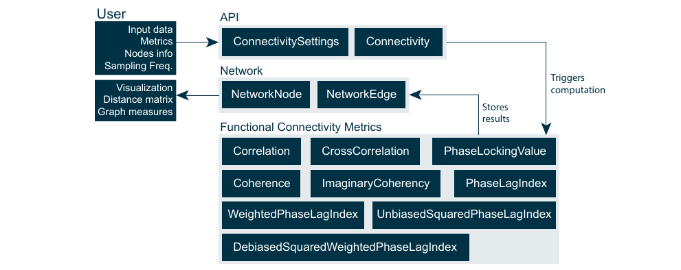

# Connectivity 

## Architecture

The Connectivity library, as part of the MNE-CPP library layer, was implemented purely in C++. It includes routines to calculate **functional connectivity metrics**, a container to store the resulting networks and an API. All features were implemented with real-time capability in mind. The library was designed to be as generic as possible, in order to not limit its functionality to only a set of specific use cases and measurement modalities. Also, it should be extensible to include new connectivity metrics, e.g., effective and structural in the future. The library can be divided into three groups of classes, namely the API classes, the actual computational classes for each functional connectivity metric and the network (data) container classes, see figure below. The library computes the connectivity networks over trials rather than over time. Connectivity resolved over trials is more favorable when dealing with evoked responses. Instantaneous connectivity estimates per sample via time resolved connectivity might be preferred when dealing with spontaneous and resting-state data. Instantaneous connectivity is not supported by the current implementation of the library. However, spontaneous or resting-state data can be processed by the library in form of data blocks and handled as if they were multiple trials. This workflow is common in resting-state functional connectivity studies.



The user can set the input data, specify the desired metrics and information about nodes via the *ConnectivitySettings* class. The *ConnectivitySettings* are parsed by the *Connectivity* class in order to execute the wanted metric computations and return the result in form of a Network class. The *Network* class is meant as a data container consisting out of *NetworkNode* and *NetworkEdge* classes. The *Network* class holds the nodes which were defined by the user in the *ConnectivitySettings* class. The *NetworkNodes* in return hold information about the *NetworkEdges* connecting them with other *NetworkNodes}. In order to guarantee memory efficiency all *NetworkEdges* are stored as smart pointers. This also contributes to the efficient handling of large networks with a high number of nodes and all-to-all connectedness. The *Network* class offers functions to calculate the distance matrix, basic graph measures and threshold the network based on edge weights. Currently, the threshold for reducing the amount of edges needs to be set manually by the user via the GUI or developer via the source code.

## Usage

The API is realized by the *Connectivity* and *ConnectivitySettings* classes. An example of how to compute the all-to-all functional connectivity of a set of trials, read from a MEG recording, is presented in the code example below. The term trial hereby refers to stimulus locked data segments recorded during an evoked response experiment. In a resting-state experiment, with no stimulus present, the data are split into evenly spaced segments. These segments are then treated as trials, implicitly assuming that the statistical interdependence between brain regions is constant over the time of the experiment.

```cpp
//Prepare input data
FiffRawData raw("sample_audvis_raw.fif");
RowVectorXi picks = raw.info.pick_types("grad");
Eigen::MatrixXi events;
MNE::read_events("sample_audvis_raw-eve.fif", events);

//Read epochs/trials from -100ms to 400ms relative to event type 3 triggers
MNEEpochDataList data;
data = MNEEpochDataList::readEpochs(raw, events, -0.1, 0.4, 3, picks);

//Setup connectivity settings
ConnectivitySettings settings;
settings.setNodePositions(raw.info, picks);
settings.setConnectivityMethods(QStringList() << "pli" << "imagcohy");
settings.setSamplingFrequency(raw.info.sfreq);
for (MNEEpochData::SPtr pItem: data)
	settings.append(pItem->epoch);

//Compute the networks
QList<Network> networks = Connectivity::calculate(settings);
```

Functional connectivity analysis on source-level is supported as well. Here, the *data* parameter would simply hold source instead of sensor signals.

## Supported Metrics

Currently, the following functional connectivity metrics are implemented in the connectivity library. 

| Metric name | Library keyword | 
|-------------|-------------|
| Correlation | cor |
| Cross Correlation | xcor |
| Coherence | coh |
| Imaginary Coherence | imagcohy |
| Phase Locking Value | plv |
| Phase Lag Index | pli |
| Weighted Phase Lag Index | wpli |
| Unbiased Squared Phase Lag Index | uspli |
| Debiased Squared Weighted Phase Lag Index | dswpli |
