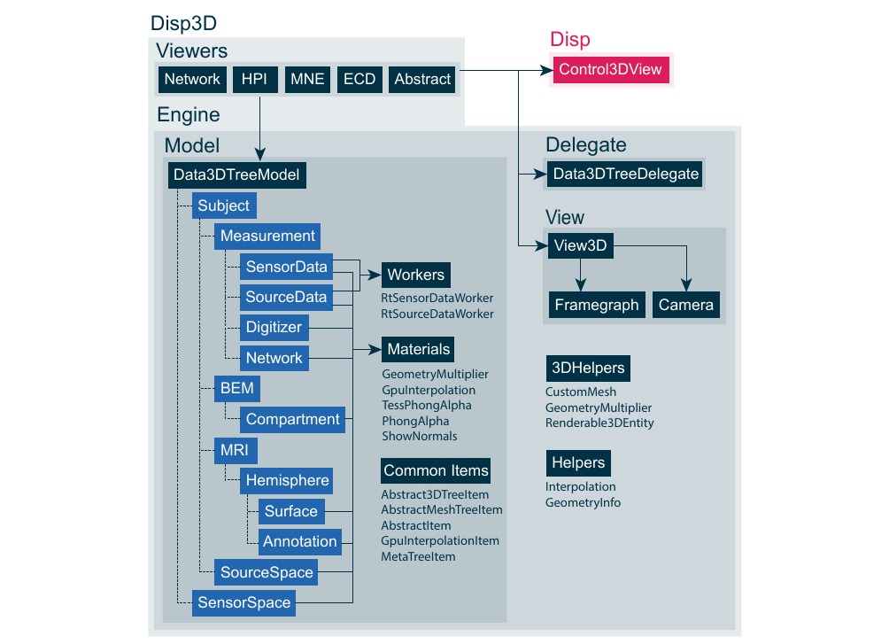
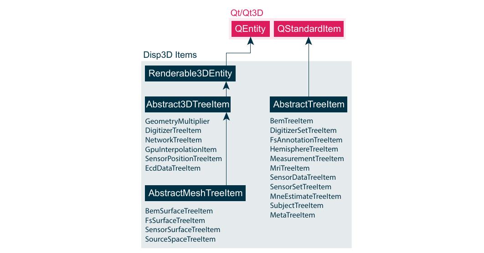

# Disp3D 

All 3D visualization in MNE-CPP is realized within the Disp3D library, which is based on the Qt3D module. Qt3D is part of the Qt framework and actively developed by the KDAB group. The Qt3D module offers a layer on top of native OpenGL or Vulkan. It supports cross-platform compilation, is seamlessly integrated into the Qt framework and thus does not impose another external dependency on MNE-CPP. Qt3D utilizes a so called framegraph and scenegraph approach. The framegraph is a description of how to render. The scenegraph is a description of what to render and is represented by an Entity-Relationship-Model (ECM). In an ECM, entities describe general purpose objects, which aggregate so called components. These components are highly versatile and describe what the object is actually made of. In case of Qt3D, a component can, e.g., be a surface mesh, material, 3D transformation, etc. The framegraph includes information about different render stages and specifies what each render run is composed of.



The above figure depicts a simplified version of the Disp3D architecture and components. Disp3D consists out of two main components: Viewers and an engine. The latter hosts the data model, delegate and view. The *Framegraph* and *Camera* are included in Disp3D's view module and are both utilized by the *View3D* class. The *Camera* class provides the user to freely rotate the 3D scene. 

Disp3D is backboned by its own tree (graph) based model *Data3DTreeModel* to store and organize data. The renderable tree model items inherit from the *Renderable3DEntity* class which itself inherits from Qt3D's *QEntity* class. Hence, next to organizing Disp3D's data, the *Data3DTreeModel* also serves as the scenegraph needed to render a 3D scene with Qt3D. Each tree item specializes in the visualization of a specific data type and includes parameters to change the visualization options on the fly during run-time. 

The *Data3DTreeDelegate* was implemented to create appropriate editors for the item's control parameters. These control parameters can be changed by the user during the visualization. *Data3DTreeModel* and *Data3DTreeDelegate* can be passed to a *Control3DView*, which uses a *QTreeView* to display the entire Disp3D data tree and the items' control parameters with corresponding editors. Please note that since the *Control3DView* class is a GUI widget it is not actually part of the Disp3D but the Disp library. 

Materials ensure the correct displaying and interpolation of data. The materials internally rely on graphics shaders written in GLSL, which are executed on the GPU. Five materials and corresponding shaders were implemented in order to visualize and interpolate data in real-time. Two workers were implemented to stream sensor and source-level data sample-wise to the corresponding tree items. 

## Usage 

The Disp3D API is designed to minimize the user's exposure to low level functionality. There are two ways the user can utilize Disp3D to visualize data. First, the user can work with viewers, which already include all necessary tools to visualize a specific data type. Viewers have the advantage that they are easier to setup and come with already implemented control parameters depending on the data type. Code snippet \ref{lst:methods:disp3d_viewers* presents how to visualize the connectivity results generated with Code Snippet \ref{lst:methods:connectivity}.

```cpp
//Network data
QList<Network> networks;

//Init the NetworkView and add data
NetworkView networkView;
networkView.addData("sample", "audvis", networks);
```

Second, the user can implement a *View3D* and simply add data to its tree model. In order to allow the changing of control parameters, the user can implement a *Control3DView* GUI widget and pass a *Data3DTreeModel* and a *Data3DTreeDelegate* to it. See the following code snippet for an example:

```cpp
//Init 3D view and model
View3D* p3DView = new View3D();
Data3DTreeModel* pDataModel = new Data3DTreeModel();
p3DView->setModel(pDataModel);

//Init 3D control
Control3DView* pControl3DView = new Control3DView();
Data3DTreeDelegate* pData3DTreeDelegate = new Data3DTreeDelegate();

pControl3DView->setDelegate(pData3DTreeDelegate);
pControl3DView->setModel(pDataModel);

//Add BEM data
MNEBem bem(QFile("sample-5120-5120-5120-bem.fif"));
pDataModel->addBemData("sample", "BEM", bem);

//Add source-level data for left hemisphere
MNESourceEstimate sourceData(QFile("sample_audvis-meg-eeg-lh.stc"));
MNEForwardSolution fwd(QFile("sample_audvis-meg-eeg-oct-6-fwd.fif"));
SurfaceSet surfSet("sample", 0, "inflated", "../resources/data/MNE-sample-data/subjects");
pDataModel->addSourceData("sample", "audvis", sourceData, fwd, surfSet);
```

## Supported Data Types and Items

The Disp3D library supports several data types as input to its model and render pipeline. Next to functional data, Disp3D is able to visualize anatomical and other measurement related information. Some of the *Data3DTreeModel* items are solely used for organizational purposes, e.g., to group subjects, measurements or MRI reconstructed hemispheres, to name a few. Organizational items inherit from the *AbstractTreeItem* class, which again inherit from *QStandardTreeItem}, see Figure \ref{fig:methods:disp3ditems}. They are therefore excluded from the scenegraph needed by Qt3D to render the 3D scene. All other items inherting from *Abstract3DTreeItem* or *AbstractMeshTreeItem* class are included in Qt3D's render process since they ultimately inherit, through the *RenderableEntity* class, from Qt3D's *QEntity* class. 

Basic geometric 3D primitives, such as sphere, cones, use the *Abstract3DTreeItem* functionalities. More complex 3D objects, such as surface meshes, use the *AbstractMeshTreeItem* functionalities. *MetaTreeItem* objects are used as children of a tree item, e.g., a *FsSurfaceTreeItem}, to present additional information about the visualized data and to provide user input editors, e.g., color pickers for changing the surface color. *MetaTreeItem* objects are described by types, which are parsed by the *Data3DTreeDelegate* to create the corresponding user input editors.  



**3D MRI Reconstructions and Annotations** 
Surface reconstructions and annotations created with the Freesurfer toolbox can be visualized with Disp3D. The surface vertices, normals and triangulation data are passed to a *FsSurfaceTreeItem* object. Here, the data are used to create a *CustomMesh* object, which inherits from Qt3D's *QGeometryRenderer}. Next to the input data the *CustomMesh* uses the *PhongAlpha* material to create a Phong lighting model with support for transparency (alpha channel). The annotation data are stored in a separate *FsAnnotationTreeItem* object, which colorizes the *FsSurfaceTreeItem* based on the color per patch information. Both, *FsSurfaceTreeItem* and *FsAnnotationTreeItem}, are stored hemisphere-wise as children of the *MriTreeItem* and *MeasurementTreeItem* classes.

**Digitizer Data**
The locations of HPI coils, fiducial markers and additional head surface points can be visualized with the *DigitizerTreeItem* class. The data are colored based on their type (HPI, fiducial marker or additional point) and are visualized with the help of the *GeometryMultiplier* and Qt3D's *QSphereGeometry* classes. The *GeometryMultiplier* facilitates so called instance rendering via the *GeometryMultiplierMaterial}. Instead of sending the same 3D primitive mesh (*QSphereGeometry}) to the GPU for every, e.g., additional head surface point, the mesh information (vertices, normals, triangles) is only send once. Instance rendering only needs the transformations in 3D space (translation and rotation) as well as the colors per instance in order to 3D render the full data set. This saves recurrent calls as well as data transfers from MNE to GPU and allows the efficient rendering of 3D scenes consisting out of a large amount of the same 3D primitive. All digitizer related items are grouped under the *DigitizerSetTreeItem* and *MeasurementTreeItem* classes.

**M/EEG Sensors** 
The M/EEG sensors are visualized via the *GeometryMultiplier* class as described above. In case of MEG, the helmet surface can be plotted with the help of the *SensorSurfaceTreeItem* class. All sensor information related items are grouped under the *SensorSetTreeItem* and *MeasurementTreeItem* class.

**M/EEG Data** 
M/EEG sensor level data can be visualized topographically on the 3D helmet surface or scalp BEM compartment, respectively. The *SensorDataTreeItem* holds a *CustomMesh* object with the helmet surface or scalp BEM data. The color values of the *CustomMesh* object correspond to the interpolated MEG or EEG data per sample. The real-time interpolation and visualization are described in more detail in Section \ref{sec:methods:disp3d:rtvis}. M/EEG sensor level data items are grouped under the *MeasurementTreeItem* class.

**BEM Compartments** 
The *BemSurfaceTreeItem* class visualizes BEM compartments. The internal rendering is done similar to the one described for 3D MRI reconstructions. BEM data items are grouped under the *BemTreeItem* class.

**Source Space Model** 
The source model created during the forward modeling can be visualized in 3D with the *SourceSpaceTreeItem* class. The input data can be passed in form of a forward solution defined by the *MNESourceSpace* class. The included surface is rendered similar to the one described for 3D MRI reconstructions. The modeled sources are rendered as spheres with *QSphereGeometry* and the *GeometryMultiplier* classes. Hence , the sources' orientation are discarded for visualization purposes. Source space items are grouped under the *HemisphereTreeItem* and *MeasurementTreeItem* classes.

**MNE Data**  
source-level data in form of \glspl{mne* can be visualized with the help of the *MneTreeItem* class. The class functions similar to the ones defined in *SensorDataTreeItem}. The dipole orientations are not visualized, instead the MNE amplitudes are interpolated and plotted on a cortical surface reconstruction. The real-time interpolation and visualization is described in more detail in Section \ref{sec:methods:disp3d:rtvis}. source-level data items are grouped under the *MeasurementTreeItem* class.

**Equivalent Current Dipoles (ECDs)** 
ECD data are visualized as 3D cones pointing in the dipole moment's direction. The *EcdDataTreeItem* class uses the *QConeGeometry* and *GeometryMultiplier* classes in order to render the data. ECD data items are grouped under the *MeasurementTreeItem* class.

**Functional Connectivity Networks** 
Connectivity networks and their including nodes as well as edges are plotted via the *NetworkTreeItem* class. The edges can be colorized in respect to their weight and a prior defined color map. The diameters of the edges reflect the strength of their weights. The nodes can be colorized in respect to their degree and a prior defined color map. The diameter of the nodes is proportional to their degree, making it easy to spot hubs during visualization. The nodes are rendered as *QSphereGeometry* objects via instance rendering. The edges are rendered as *QCylinderGeometry* objects. In order to connect nodes with edges, a transformation matrix is computed which is passed to the edge instance rendering process in the *GeometryMultiplier* class. The transformation matrices translate, rotate and scale the cylinders (edges) to the position in between the two connecting nodes. The diameter of the cylinder is chosen to be small enough to not corrupt the visualization presented to the user. Network data items are grouped under the *MeasurementTreeItem* class.

## User Interaction

The user can rotate the camera either via the arrow keys or the right mouse button. The camera can be translated via the middle mouse button. The left mouse button is reserved for the upcoming support for vertex picking. Furthermore, the user is able to change multiple parameters affecting the visualization and interpolation of the data during run time. The *Control3DView* class together with its *QTreeView* serve as user input interface. Each item in the *Data3DTreeModel* is presented in the *QTreeView* via the *Data3DTreeDelegate}. Some items hold extra information about the data and are non interactive. Others can be used to change parameters on the fly. The delegate provides the user with the appropriate editor. The table below gives a summary of which parameters the user can see and change in each item.

| Class Name | Possible User Interaction | 
|-------|-------|
| BemTreeItem | Toggle on/off|  
| DigitizerSetTreeItem | Toggle on/off |  
| HemisphereTreeItem | Toggle on/off|  
| MeasurementTreeItem | Toggle on/off |  
| MriTreeItem | Toggle on/off |  
| SensorSetTreeItem | Toggle on/off |  
| SubjectTreeItem | Toggle on/off |  
| MetaTreeItem | Toggle on/off |  
|-------|-------|
| AbstractTreeItem | Toggle on/off |  
| Abstract3DTreeItem | Toggle on/off, translate, scale, change color, change transparency|  
| AbstractMeshTreeItem | Same as Abstract3DTreeItem, change material, change inner/outer tessellation, change triangle scale|   
|-------|-------|
| FsAnnotTreeItem | Same as AbstractTreeItem, display file name |  
| FsSurfaceTreeItem | Same as AbstractMeshTreeItem, change sulci/gyri color, display file name |  
| SensorDataTreeItem | Same as AbstractTreeItem, start/stop streaming, change colormap, change threshold, toggle loop mode, change number of trials to average, change streaming interval, change interpolation method |  
| MneTreeItem | Same as AbstractTreeItem, start/stop streaming, toggle between annotation or interpolation based visualization, change colormap, change threshold, toggle loop mode, change number of averages, change streaming interval, change interpolation method|  
| NetworkTreeItem | Same as Abstract3DTreeItem, change weight threshold, view connectivity matrix |  
| DigitizerTreeItem | Same as Abstract3DTreeItem |  
| SensorPositionTreeItem | Same as Abstract3DTreeItem |  
| EcdDataTreeItem | Same as Abstract3DTreeItem |  
| GpuInterpolationTreeItem | Same as Abstract3DTreeItem |  
| BemSurfaceTreeItem | Same as AbstractMeshTreeItem |  
| SensorSurfaceTreeItem | Same as AbstractMeshTreeItem |  
| SourceSpaceTreeItem | Same as AbstractMeshTreeItem | 