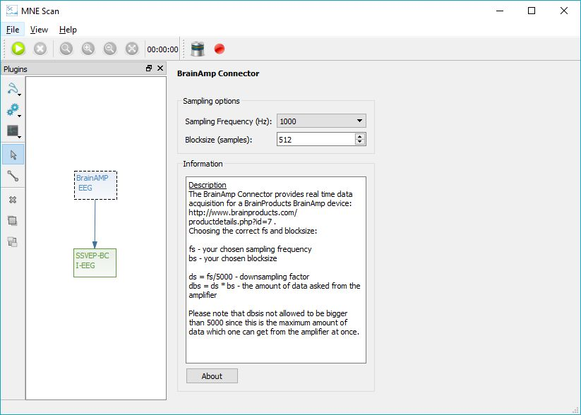

# BrainAmp

## Abstract

This article describes the installation and usage of the BrainAMP EEG driver plugin for the MNE Scan project.

## Building the BrainAMP EEG plugin

In order to build the BrainAMP driver, at first, the header file "BrainAmpIoCtl.h" from the BrainAMP SDK has to be included into the mne-cpp project. These files can be found in the device's attached software library. They have to be copied to the BrainAMP driver repository which is to be found under:

`%\mne-cpp\applications\mne_scan\plugins\brainamp`

In a second step, the plugin's source code has to be reintegrated into the mne-cpp project. Therefore, in the file :

`%\mne-cpp\applications\mne_scan\plugins\plugins.pro`

the plugin's project "brainamp" has to be restored by deleting the "#" in front of the name in the Sensor section. After this is done, the MNE Scan project can be rebuilt.

## Running the BrainAMP EEG plugin

For running the BrainAMP EEG plugin, the according driver has to be installed to the operating system. The files can also be found on the device attached software, as well as a documentation which will guide the whole process. After that, the BrainAMP EEG plugin can be used in the MNE Scan environment, like shown in the following figure.

Delivered sample frequency and block size can be set on the plugin's surface. Please mind the depicted information. After the settings are done, the acquisition can be started with the green "run" button.
