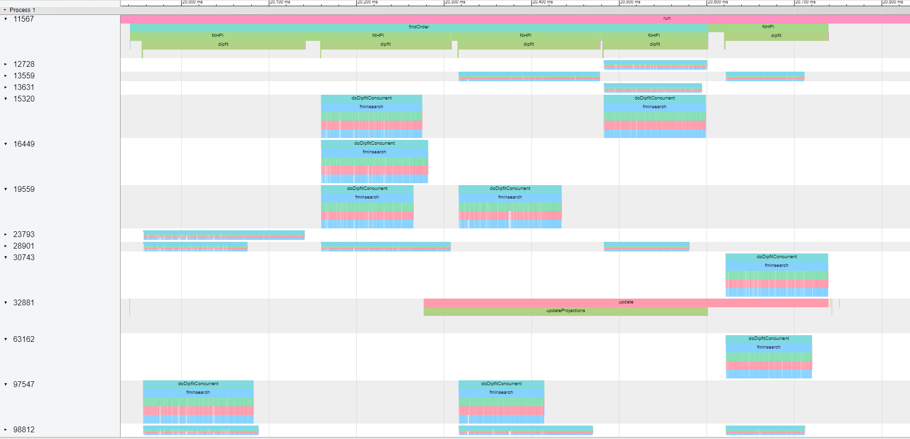
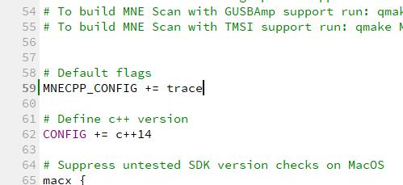

# MNE Tracer

***
                It is very hard to improve what you can not measure.
***

During development it is common to have to decide between two (or more) different but equivalent implementations. We value improving code maintainability and coherence on top of achieving an efficient-as-possible implementation. But still, it is not uncommon to find situations when two solutions seem equally valid. In this scenario, to be able to understand the performance implications of each option can be really useful. It can help understand better each decision and obtain a more informed opinion, thus learnign through out the process. MNE Tracer was designed for this situations. A code tracer is a tool that registers when does each method is being executed.

MNE Tracer does this register using a json file where each function call you specify gets recorded as an event. The format used in this json file is compatible with Google Chrome browser's tracer application and with QtCreator related plugin. To view and study your code you just have to open a chrome browser and go to ```chrome://tracing```. Then load your json file generated with MNE Tracer.



## Add MNE Tracer to your code

In order to use there are basically three steps.
- The functionality is ready in the Utils library (under ```libraries/utils```), so please make sure that Utils library is correctly added to your project (if you're using our recommended settings, this should be the case by default). But make sure Utils lib is correctly linked to your project. 
- You will need to define the macro ```TRACE``` in your code. If you are using QtCreator and the project's build engine configuration files, you can add the ```trace``` option to the ```MNECPP_CONFIG``` variable in the ```mne-cpp.pri``` file (see image). You can also do this either through the command-line or through the project configuration options. You can also manually add the line ```#include TRACE``` to your code, however we recommend using the build-engine options. 



- Finally, and as usual with any C++ dependency, you have to include MNE Tracer's header file in whatever code you want to be able to use it. You can do that by adding the line ```#include <utils/mnetracer.h>```. Typically, every library, plugin or application has a global_project.h header file, which is in-turn included in every file within a project. If you include the line there, it is a neat way of making sure it will be included everywhere needed.

If the utils library is correctly linked to your project, the ```TRACE``` macro is defined and the header files are included, everything should be ready to instantiate and use.
## Using MNE Tracer

### Enable and disabling the tracer
Before recording the time point where your code starts we need to make sure the tracer output file is correctly initialized. We make sure this is the case by adding the macro ```MNE_TRACER_ENABLE(filename.json)``` to your code. The name of the output json file can be specified here so that it describes the particular test you are doing at the moment. And the file will be saved in the same folder your binary application is running. 
After this line is executed, every function call you specify as "traceable" will be recorded and registered in the tracer file.
Finally, after using the tracer we need to correctly format and close the output register file. We do this by adding the macro ```MNE_TRACER_DISABLE``` to our project. Execution after that point will not tracer anythin.

For instance, a test of a plugin of an application could be configured correctly if we added this to the main function.

```c++
int main(int argc, char *argv[])
{
    MNE_TRACER_ENABLE(filename.json)

    //... your application starts here
    //... you can trace specific function calls 
    //... at this point by adding the
    //... macro MNE_TRACE() to your code.

    MNE_TRACER_DISABLE

    return returnValue;
}
```

### Specifying which function calls should be traced
In a typical C++ application too many generic function calls happen in order to get a specific portion of our code running. So in order to let the user concentrate on a subset of specific calls to mnonitor, trace and study, you have to add a specific signal in the code to let the tracer know that this function should be traced.

Add the macro ```MNE_TRACE()``` to the first line after the opening brackets of the function/method you want to trace. 

```C++
void ImportantClass::importantMethod(int a)
{
    MNE_TRACE()
    //...the method continues here
    //...
}
```
### Automatically adding all the methods in a class to MNE Tracer
If you are interested in tracing every single method in a class, instead of manually adding the macro ```MNE_TRACE()``` to every single method, you can use a Python tool we have developed that includes the macro automatically in your ```.cpp``` file.

The script is ```tools/python``` named ```mnetracer.py```. To use it just do as follows:

- To add the ```MNE_TRACE()``` macro to every method:
```python
python mnetracer.py file=<yourfile.cpp> mode=add
```
` To delete the ```MNE_TRACE()``` at the begining of each method you can use the following mode. Note that if in the file there are other ```MNE_TRACE()``` macros already defined to be able to follow specific sections of your code, those will not be deleted. 
```python
python mnetracer.py file=<yourfile.cpp> mode=delete
```
- To delete every single line in which the macro ```MNE_TRACE()``` is included.
```python
python mnetracer.py file=<yourfile.cpp> mode=deleteAll
```

_Happy tracing!_

