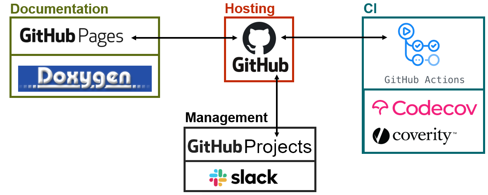

# How to contribute to the MNE-CPP Project

## Welcome aboard!

Before you start, there are a few basic concepts that should be understood. We use a variety of different tools to develop and maintain MNE-CPP.

## Before you start

Learn C++ and the [Qt Framework](https://www.qt.io/){:target="_blank" rel="noopener"}. 

We mainly use C++ programming language and Qt, for development purposes. We are very happy with the choice, but these technologies can be quite tricky. There are plenty of fantastic resources out there to be able to learn both, but if you feel stuck, go ahead and ask us. Since you intend to become a contributor, we recommend you to start using Github and open an issue in the MNE-CPP project, in order to communicate with the development team.

## Know the tools and services used by the development team

 We use [GitHub](https://github.com/mne-tools/mne-cpp){:target="_blank" rel="noopener"} to host the source code for MNE-CPP. Continuous integration tools are provided by [GitHub Actions](https://github.com/mne-tools/mne-cpp/actions){:target="_blank" rel="noopener"}, [Codecov](https://codecov.io/gh/mne-tools/mne-cpp){:target="_blank" rel="noopener"} and [Coverity](https://scan.coverity.com/projects/mne-tools-mne-cpp){:target="_blank" rel="noopener"}. For communication and project management we use GitHub Projects, [Gitter](https://gitter.im/mne-tools/mne-cpp){:target="_blank" rel="noopener"} as well as [Slack](https://join.slack.com/t/mne-cpp/shared_invite/zt-cm5uwh2q-NLx92vkfNuT0Qf2iCq8TAA){:target="_blank" rel="noopener"}. MNE-CPP's API documentation is build with [Doxygen](http://www.doxygen.nl/){:target="_blank" rel="noopener"}.

Please [contact us](../../contact.md) with any questions you may have.

## Understand the structure of MNE-CPP

MNE-CPP is designed as a two-layer framework. The [library API](api.md) provides the core functionalities, which can be used during development. The stand-alone applications, examples and tests are realized within the application layer of MNE-CPP. For example, as a stand-alone software, MNE Scan is part of the application layer and makes use of the functionality of the library layer. We use make use of the [Eigen](http://eigen.tuxfamily.org/index.php?title=Main_Page){:target="_blank" rel="noopener"} library, which is integrated into our repository. [Qt](https://www.qt.io/){:target="_blank" rel="noopener"} provides tools for GUI creation whereas Eigen provides mathematical operations for linear algebra.

Below are some resources to get you started developing within MNE-CPP. Depending on which application you intend to develop for, you will find specific resources in this section. You can use use our [API documentation](https://mne-cpp.github.io/doxygen-api/annotated.html){:target="_blank" rel="noopener"} to guide you while understanding the responsabilities of each class.

## Contribute

It is a good idea to go through the [contribution tutorial](contribute.md) and make sure that you can build from source. Understand the continious integration pipeline we have in place and how to write a unit test. Make sure that your changes don't break the project compilation before submitting your contribution to the project itself.

