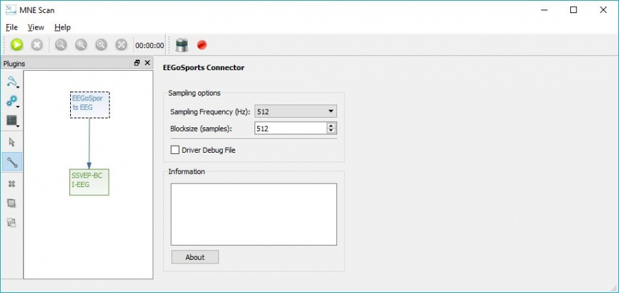

# EEGoSports

## Abstract

This article describes the installation and usage of the EEGoSports EEG driver plugin for the MNE Scan project.

## Building the EEGoSports EEG plugin

In order to build the EEGoSports driver plugin, the "eemagine" folder from the SDK has to be added to the EEGoSports folder in the mne-cpp repository in a first step. This location can be found in the mne-cpp repository under:

`%\mne-cpp\applications\mne_scan\plugins\eegosports\`

The "eemagine" folder includes another folder called "sdk" which holds the necessary header and source files like: amplifier.h, buffer.h, channel.h, exceptions.h, factory.h, stream.h, version.h, wrapper.cpp and wrapper.h.

In a second step, the eegosports subproject has to be reintegrated into the mne-cpp project. This can be achieved by removing its comment status in the plugins' project file. This file can be found under following path:

`%\mne-cpp\applications\mne_scan\plugins.pro`

In order to reintegrate the eegosports subproject into mne-cpp, its comment status has to be removed in this file. This can be achieved by removing the # sign in front of the eegosports project in the Sensors category.

Now, the whole mne-cpp can be rebuilt as normal. MNE Scan then will contain the EEGoSports driver plugin in its Sensor plugin section.

## Running the EEGoSports EEG plugin

For a correct recognition of the EEGoSports device, the operating system compatible driver has to be installed with the delivered software. Furthermore the two files "eego-SDK.lib" and "eego-SDK.dll" from the driver's library have to be copied to the location:

`%\mne-cpp\bin`

In a last step, the license files which are delivered with the device have to be copied to

`C:\Users\Username\Documents\Eego`

The license files should be named like "EE225-020032-000001".

After that, the device can be connected to the computer and be switched on and MNE Scan can be started. It is now possible to use the EEGoSports Driver plugin in the MNE Scan environment. By drag&drop, the plugin can be added to the plugin box and connected to other processing items like shown in the following figure.

The GUI of the EEGoSports EEG plugin allows the adjustment of sample frequency and block size. A FIFF-data-stream is now given to every connected processing plugin.
