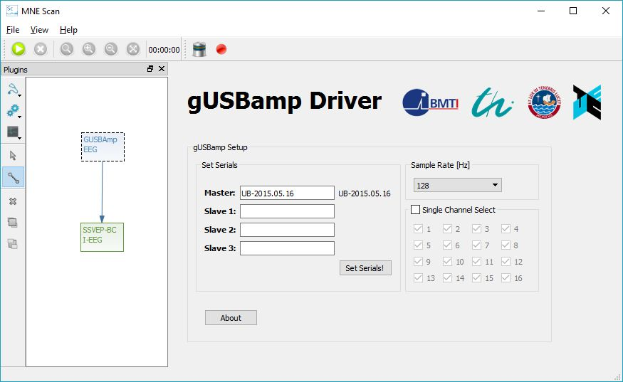

# GUSBAmp

## Abstract

This article describes the installation and usage of the gUSBamp EEG driver plugin for the MNE Scan project.

## Building the gUSBamp EEG plugin

In order to build the gUSBamp driver, at first, the header file "gtec_gUSBamp.h" and the two library files "gUSBamp_x64.lib" and "gUSBamp_x86.lib" from the gUSBamp SDK have to be included into the mne-cpp project. These files can be found in the device's attached software library. They have to be copied to the gUSBamp driver repository which is to be found under:

 `%\mne-cpp\applications\mne_scan\plugins\gusbamp`

In a second step, the plugin's source code has to be reintegrated into the mne-cpp project. Therefore, in the file :

 `%\mne-cpp\applications\mne_scan\plugins\plugins.pro`

the plugin's project "gusbamp" has to be restored by deleting the "#" in front of the name in the Sensor section. After this is done, the MNE Scan project can be rebuilt.

## Running the gUSBamp EEG plugin

For running the gUSBamp EEG plugin, the according driver has to be installed to the operating system. The files can also be found on the device attached software, as well as a documentation which will guide the whole process. After that, the gUSBamp EEG plugin can be used in the MNE Scan environment, like shown in the following figure.

The connected devices and the sample frequency can be set under "set serials" ande "sample rate". Up to 3 more gUSBamp slaves can be connected to one gUSBamp master. Usually, all channels are selected by default. Under "Single Channel Select", this can be changed by clicking on the desired selection. After the settings are done, the acquisition can be started with the green "run" button.
