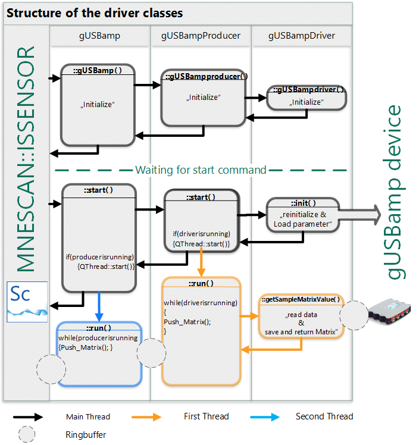

# Acquisition Plugins in MNE Scan

The acquisition plugins of MNE Scan have similiar structure and therefore can be explained on the basis of the gUSBamp EEG driver example. The following flow sheet describes the structure of this acquisition plugin.

On the left side the border of MNE Scan can be seen, whereas on the right side the border to the actual device, in this case the gUSBamp amplifier, is depicted. In between, according to their hierarchical order, the three classes are shown as the interface between program and device:

* **gUSBamp**: regulates the communication between MNE Scan and the driver and acts as the main plugin class.
* **gUSBampproducer**: controls the data acquisition and manages the interface between driver and gUSBamp
* **gUSBampdriver**: actual driver which provides data acquisition and controls the communication between the project and the device

However, `gUSBampdriver` is the actual class used to communicate and exchange data with the device. The `gUSBamp` and `gUSBampproducer` classes can be seen as a way, how to integrate the gUSBampdriver class properly into the project.

When establishing a new plugin to the plugin-box like shown in the gUSBAmp example, all three classes are initialized one after another by calling the constructors. During this process, all default parameter are generated. After that, the main thread returns to the program and the driver plugin is waiting for the start command or further changing instructions of the parameter by the GUI.

By starting the acquisition, one class invokes the next. At the end, the `gUSBampdriver` class initializes the device with the new parameters and sets the device status to "run". After that, `gUSBamp` and `gUSBampproducer` class are each starting an internal thread which call repetitively for new data packages from the subordinate class and returning them to the overlying class until the data packages reach the MNE Scan environment. This is achieved with so called ring buffers and leads to a continuous data stream.

When stopping the acquisition, both threads are interrupted by putting the `is_running` parameter to false and the `gUSBampdriver` class puts the device into standby mode.
