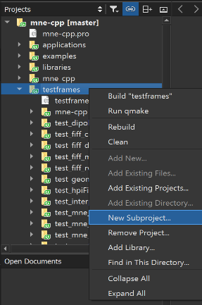

# Writing a Unit Test

As already mentioned in the coding conventions, we require unit tests for newly added functionalities. The focus hereby lies on functional testing rather than 100% code coverage. Writing a test usually helps oneself to completely understand what you code is doing. Further, it is necessary for our CI-pipeline to provide tests and to ensure the stability of our software. Failing tests are the first indicator, that your function or change broke something in the project. This guide will show you how to write a test for your new functionality in MNE-CPP and what you should keep in mind.

## What and How to Test

In general, every new functionality should be tested. You should think about the use-case of your function and think about how to prove or validate your function. It is possible to compare the output of your function to the output of another software package, e.g. MNE-Matlab, MNE-C or MNE-Python. Once you know what you want to test and have your reference results to compare to, you can carry on with the following steps.

## Creating a new Test

As part of the MNE-CPP wizards for QtCreator, we provide a template for a new test project. How to setup and use the MNE-CPP wizards is described in our [Coding Conventions](conv_style.md). You can create a new test project as shown in following picture:



After this, a new window should open and allow you to choose from a variety of templates. Under `Projects` choose MNE-CPP and then `MNE-CPP Test`. After you completed all wizard steps you have created a new test project.

## Structuring the Test

Always keep our [Coding Conventions](contr_style.md) in mind. Consider taking a look at already available tests to get started. First, you create a class named after your test: `TestName`. The following code snippet shows an example for a test. The `slots` are defining the functions to execute your function `initTestCase()` and compare the output to reference values, e.g. `compareValue()`. Further, you can declare threshold values as private variables that indicate the difference which should not be exceeded when comapring. An example for a test can be found [here](https://github.com/mne-tools/mne-cpp/blob/main/testframes/test_fiff_rwr/test_fiff_rwr.cpp){:target="_blank" rel="noopener"}.

```cpp
class TestFiffRWR: public QObject
{
    Q_OBJECT

public:
    TestFiffRWR();

private slots:
    void initTestCase();
    void compareValue();
    void cleanupTestCase();

private:
    // some variables and error thresholds
    double dEpsilon;
    Eigen::MatrixXd mFirstInData;
    Eigen::MatrixXd mSecondInData;
};
```

### initTestCase()

Here you execute and declare everything that is necessary for setting up your test. You generate and load all values in a variable that can be compared to later. If you want to load external calculated data in e.g. `.txt` files you can use:

```cpp
Eigen::MatrixXd mDataFromFile;
UTILSLIB::IOUtils::read_eigen_matrix(mDataFromFile, QCoreApplication::applicationDirPath() + "../resources/data/mne-cpp-test-data/Result/<yourFile>.txt");
```

All files you use, have to be added to [mne-cpp-test-data](https://github.com/mne-tools/mne-cpp-test-data){:target="_blank" rel="noopener"}. In case you need to add new data open a Pull Request to this repository. The files you use should be as small as possible. If you need a .fif file, have a look at the already existing data first.

### compareValue()

```cpp
void TestFiffRWR::compareValue()
{
    // compare your data here, think about usefull metrics
    Eigen::MatrixXd mDataDiff = mFirstInData - mSecondInData;
    QVERIFY( mDataDiff.sum() < dEpsilon );
}
```

Here you compare the output of your functions to the reference data. The actual comparison is made by `QVERIFY`. Before the test, think about useful and meaningful measures and thresholds for your comparison. Don't combine comparisons of different values, use a new compare function instead. Once you have build the test project, you should run your test locally and debug your test.

### Possible Error Message

It might be possible that the last line of the test shows an error in your editor. Don't worry about this, once you have built the test project, the error will disappear.

```cpp
#include "test_fiff_rwr.moc"
```

### Naming Conventions

Please follow the following naming conventions when naming your test project and class:

|Object|Rule|
| --------------- | ------------------- |
| Project name 	  |`test_something_meaningful`|
| Class name 	  |`TestSomethingMeaningful`  |
