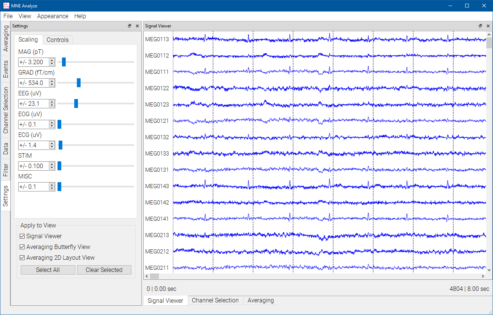
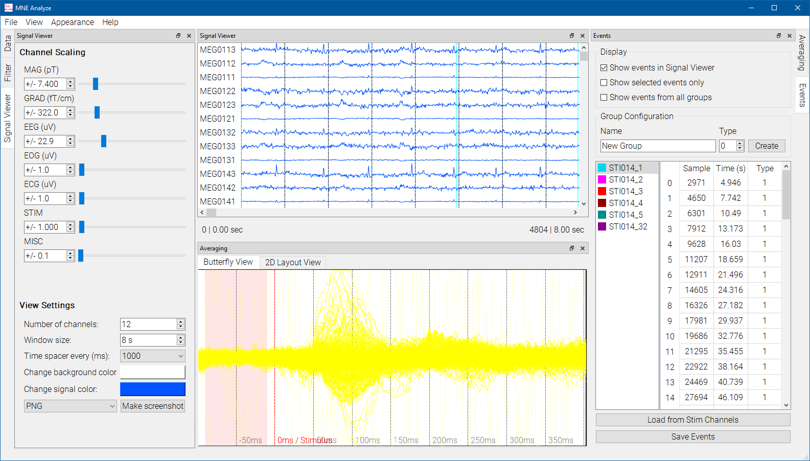

# MNE Analyze

MNE Analyze is a tool for data visualization. It currently supports the `.fif` format for loading data.

MNE Analyze offers a completely modular work area, with plugins and viewers that can stack, snap to sides, or act as separate windows.

It also has two user modes, Clinical and Research, and two view styles, Default and Dark. These can be selected from the `Appearance` menu.

Below are some guides to get you started with MNE Analyze plugins.
