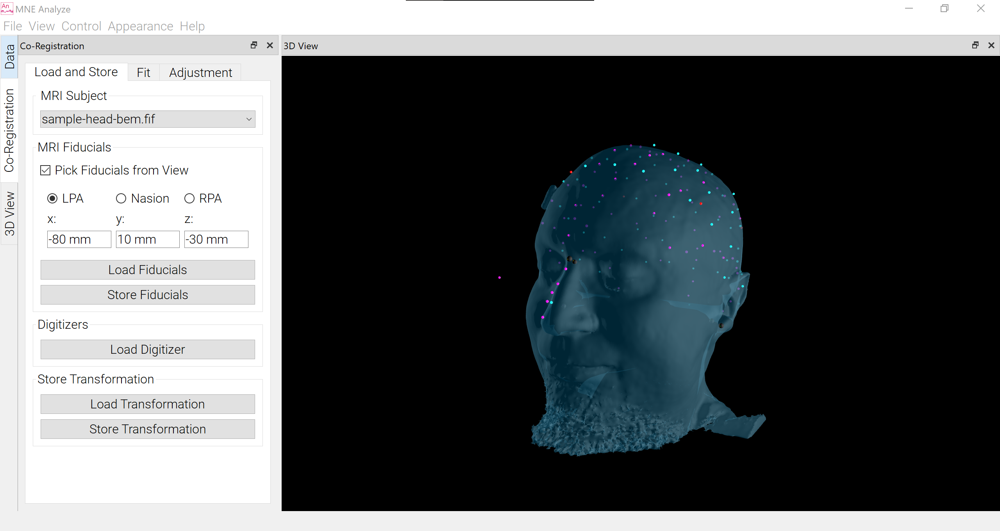
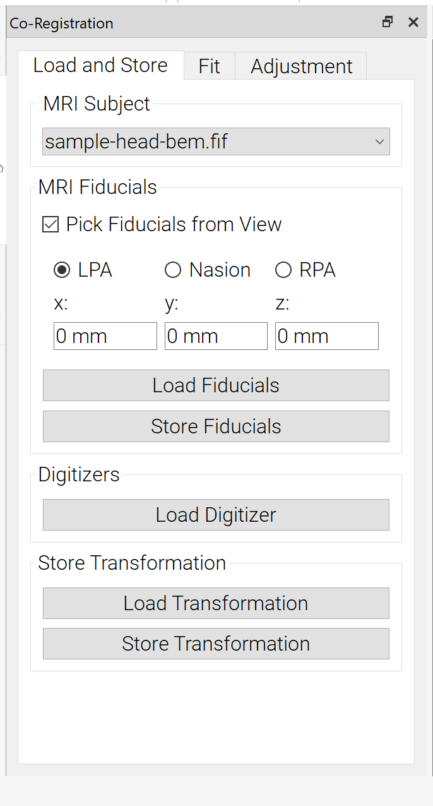
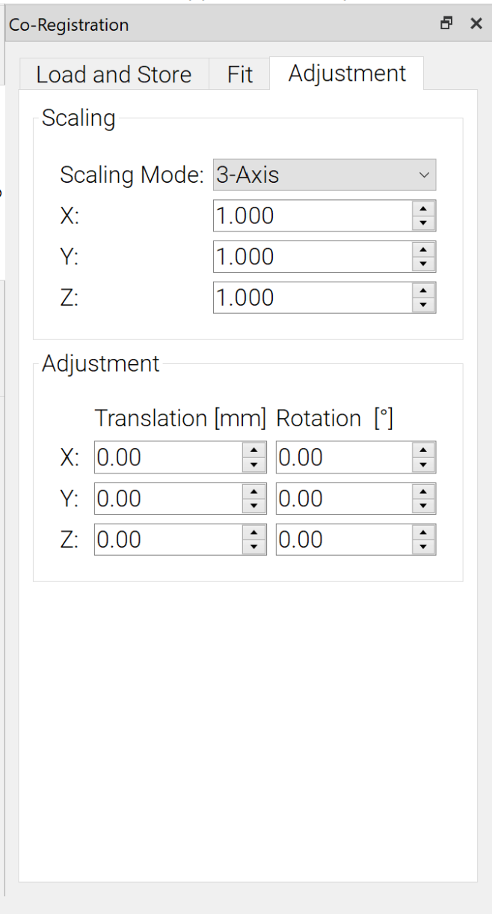

# Co-Registration

This plugin lets you co-register your subject's BEM-files with a digitizer set observed previous to the measurement. The plugin uses fiducial alignment as an initial fit and improves the result with the Iterative-Closest-Point (ICP) algorithm. You can also use pre-defined fiducials or an existing transformation. 

The following sections will show you how to use the plugin and introduce good practice. 

## Prerequisites

To perform Co-Registration, you need at least the following data:

- The Bem-Surface of your subject
- The recorded digitizers.

Optional:

- File with fiducials to skip the picking
- File containing an existing transformation to skip the co-registration procedure.

## Setup

1. Choose to show the Co-Registration and 3DView Plugin.
2. Load the BEM file of your choise via the [Data Loader](analyze_datamanager.md). Go to `Files` -> `Load` -> choose the Bem.

## Co-Registration Plugin

### Load and Store

First, you should select the BEM you want to use for co-registration in `MRI Subject`. Once done, the head surface should be visualized within the 3DView. Further, you can choose if you want to

1. load or
2. pick fiducials.

If you enable `Pick Fiducials from View`, you can choose the cardinal points for co-registration. Make sure that the location fits with the location you digitized on your subject. To pick the fiducials, make sure to open the 3DView (Toolbar: `View`->`3D View`). You can now pick the fiducials by clicking on the surface within the 3D View. The coordinates for the current selected Fiducial will be displayed. For further information and conventions on fiducials, refer to this [guide](https://neuroimage.usc.edu/brainstorm/CoordinateSystems?highlight=%28auricular%29){:target="_blank" rel="noopener"}. Once picked, you can store the fiducials to avoid picking in future sessions.

You can also use `Load Transformation` to load a previously observed transformation to avoid performing Co-Registration again. With `Store Transformation`, you can also store the observed transformation to file for future sessions.

### Fit

On this tab, you can change the settings for the actual co-registration. In `Digitizer Options`, you can select the weights for different kinds of digitized points, which type (EEG, HPI and HSP) you want to use, and the maximum allowed distance from a point to the surface should be. 

In `Fitting Options`, you can specify the maximum number of iterations for the ICP algorithm and the convergence limit. Once exceeded, the ICP terminates. With `Fit Fiducials`, a first alignment will be executed. This will be used as an initial starting point for the ICP algorithm, started with `Fit ICP`, which might take a while. 

### Adjustment

Here you can further adjust the results. You have three options for additional scaling

- `None`: no scaling applied
- `Uniform`: Same scaling on all axes
- `3-Axis`: Independent scaling for each axis.

Further, you can adjust the translation and rotation around x-,y- and z-Axis. 
