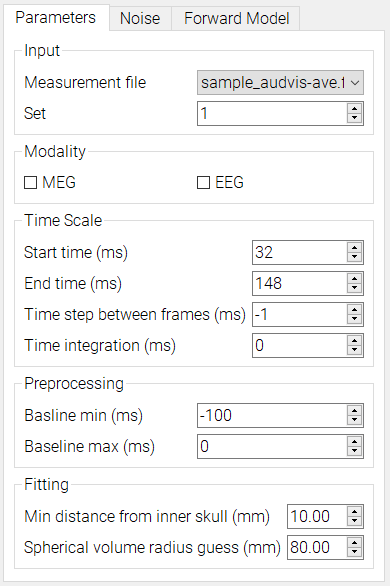
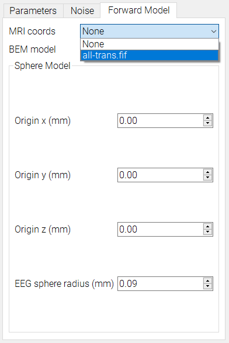
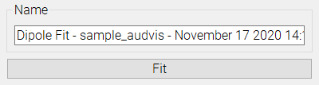

# Dipole Fit

The dipole fit lets you perform dipole fitting from raw or average fiff files. Use the GUI controls to input desired parameters and select models to use.

Select which measurement file to use from the dropdown. Any loaded file raw or average file will be added here for selection.

Use the `File` menu on the top left of MNE Analyze to load in any additional models, like BEM, MRI, or Noise, which are also added to their corresponding dropdowns and can be selected.

Use the text field at the bottom to input a name for your fit. A recommended name will be generated based on your selected parameters. Once calculated, the new fit will be added to the data manager
