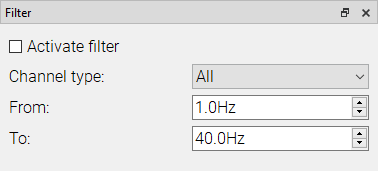
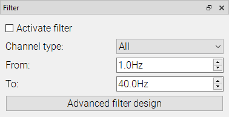
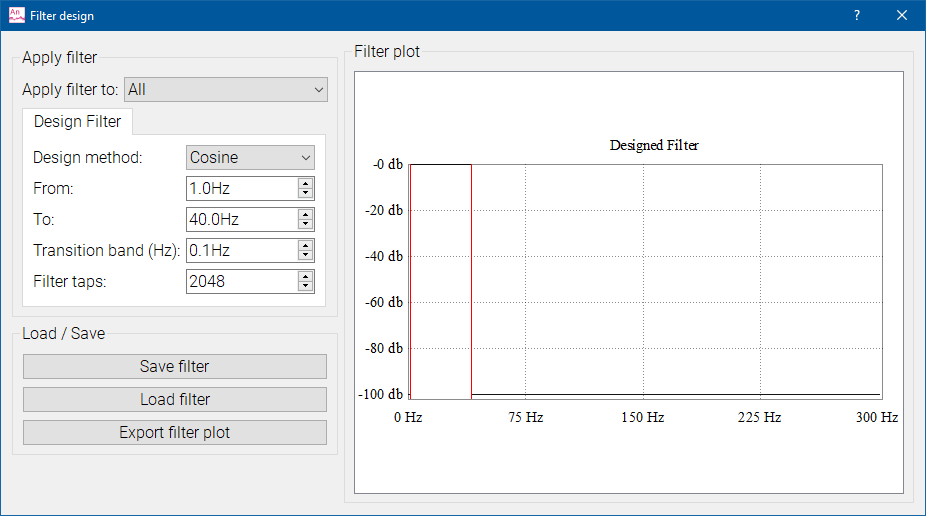

# Filtering

The filter plugin lets you select the parameters for filtering the data in the signal viewer. For a basic filter, just input the range of frequencies you want to let you filter pass and select `Activate filter`. The data displayed in the signal viewer will reflect your filter settings, which can be changed in real time.

With MNE Analyze in Research mode, you also have the option to design their filter with the `Advanced filter design` button.

Here you have more options about the types of filters and filter parameters, and are given a preview of your filter design.

