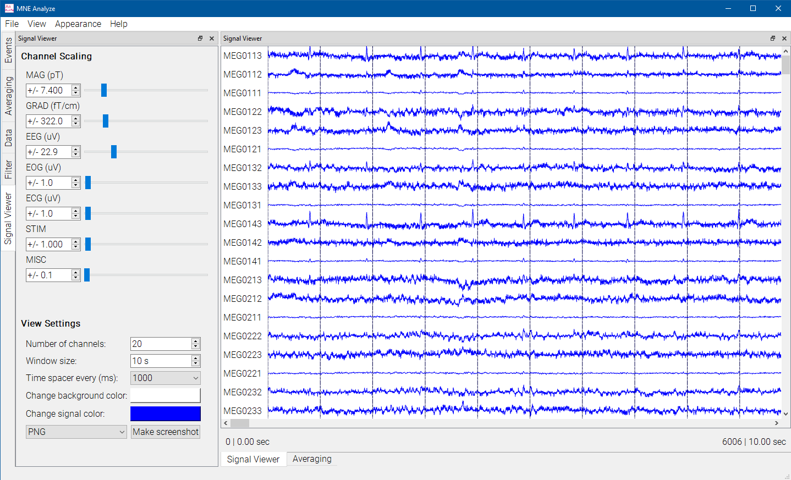

# Signal Viewer

The signal viewer handles the plotting and displaying of the currently selected data file.

The file name and parameters are displayed on the bottom, as well as current filter parameters and status.

Click on the viewer to move the signal viewer cursor to that time point. The cursor can be used to temporarily mark something, or as a location to add events to.

To control scaling and view parameters, use the [Settings](analyze_scaling.md) plugin.

The viewer also plots events, controlled by the [Events](analyze_annotationmanager.md) plugin.
