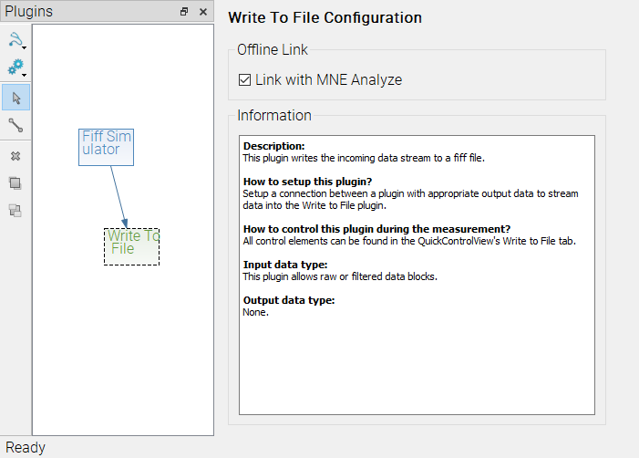
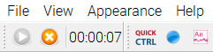

# MNE Analyze in Real-time

MNE Analyze is able to listen in to MNE Scan's real-time capabilities and display data on demand.

## Setup

Make sure MNE Scan and MNE Analyze are running from the same directory. Setting up MNE Scan and MNE Analyze can be done in any order.

### MNE Scan

 * Add the 'Write To File' plugin to the plugin scene and connect it to the source of the data.
 * Check the 'Link with MNE Analyze' checkbox.

 

### MNE Analyze

 * From the `File` menu, select `Open MNE Scan Session`

  

## Using in realtime

 * Start MNE Scan recording. You should see an MNE Analyze button next to a blinking recording button.

  

 * Click the MNE Analyze Button to open the recording up until the present in MNE Analyze.
