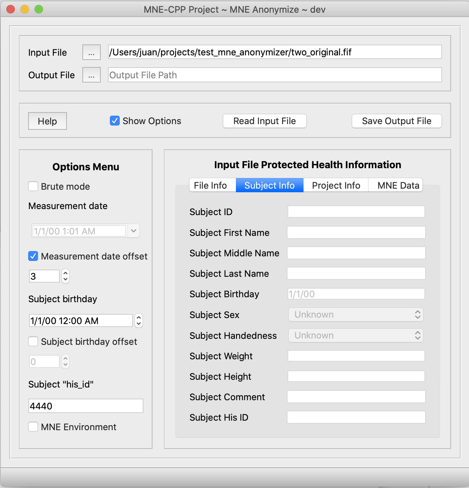

# MNE Anonymize

This page describes the application MNE Anonymize, i.e. `mne_anonymize`. This application substitutes different **Personal Health Information** (PHI) and **Personal Identifiable Information** (PII) fields from a [FIFF (Functional Imaging File Format)](https://bids-specification.readthedocs.io/en/stable/99-appendices/06-meg-file-formats.html) file (*.fif*), with other values.



##### De-identifying vs Anonymizing
PHI or PII can be substituted with default or user-specified values. This way, it is up to the user to have the output file, either anonymized or de-identified. The difference is that a de-identified file can be **re-identified** back while an anonymized one cannot.

For instance, a field included as PHI could be the **measurment date and time** (see the following paragraph for more information). With MNE Anonymize application, the measurement date and time inside a FiFF file can be either substituted with a default date or it can be modified by a number of days offset. This way, you could de-identify this field in each file within a database of FIFF files and you could then distribute the files for research purposes. At any given time, knowing the number of days to offset the measurement date, a file can be **re-identified**. (Note. This is just an example, typically *.fif* files carry a lot more protected information apart from the measurement date).

## GUI Mode

MNE Anonymize binary file is named `mne_anonymize`. By default, the application is executed in GUI mode. However, if you want to run `mne_anonymize` in GUI mode but you still want to initialize some of the options through a command line call, you can allways do so through the actual command prompt. For example, if you execute `mne_anonymize --in example.fif -bdf` the GUI will start and the options in it will be already set accordingly. The application recognizes several command line options, see bellow.

## Command line Mode 

MNE Anonymize can also be executed in command line mode. This is intended for users that might want to anonymize a considerable number of files. The following table shows all valid command line options. 

### Command line Options

| Option | Description | 
|--------|-------------|
|`-h --help`| Displays help on the command line.|
|`--no-gui`| Command line version of the application.|
|`--version`| Show the version of this appliation.|
|`-i --in <infile>`| File to anonymize.|
|`-o --out <outfile>` *optional*| Output file `<outfile>`. As default '_anonymized.fif' is attached to the file name.|
|`--verbose` *optional*| Prints out all the information about each specific anonymized field. Default: false |
|`-s --silent` *optional*| Prints no output to the terminal, other than interaction with the user or execution errors. |
|`-d --delete_input_file_after` *optional*| Delete input fiff file after anonymization. A confirmation message will be prompted to the user. Default: false |
|`-f --avoid_delete_confirmation` *optional*| Avoid confirming the deletion of the input fiff file. Default: false|
|`-b --brute` *optional*| Also anonymize subject’s weight, height, sex and handedness, and project’s ID, name, aim and comment. Default: false |
|`--md --measurement_date <value>` *optional*| Specify the measurement date. Only when anonymizing a single file. Format: DDMMYYYY Default: 01012000. |
|`--mdo --measurement_date_offset <value>` *optional*| Specify number of days to subtract to the measurement <date>. Only allowed when anonymizing a single file. Default: 0 |
|`--sb --subject_birthday <value>` *optional*| Specify the subject's birthday <date>. Only allowed when anonymizing a single file. Format: DDMMYYYY. Default: 01012000 |
|`--sbo --subject_birthday_offset <value>` *optional*| Specify number of <days> to subtract to the subject's birthday. Only allowed when anonymizing a single file. Default: 0 |
|`--his <value>` *optional*| Specify a Subject's ID within the Hospital system. Only allowed when anonymizing a single file. Default: 'mne_anonymize' |
|`--mne_environment` *optional*| Also anonymize information added to the fif file through MNE Toolbox, like Working Directory or Command used. Default: false |

## Modified FIFF *tags*

It is important to remark that tags will not be deleted. The information in the tag will be substituted by other information, either specified by the user or defined in the application by default. This utility modifies the following `tags` from the fiff file:

| Tag | Description | Default Anonymization Value |
|-----|-------------|-----------------------------|
|`FIFF_FILE_ID`, `FIFF_BLOCK_ID`, `FIFF_PARENT_FILE_ID`, `FIFF_PARENT_BLOCK_ID`, `FIFF_REF_FILE_ID`, `FIFF_REF_BLOCK_ID`| The ID tag includes a measurement date and unique machine ID. The machine ID usually contains the hardware address of the primary LAN card. | 2000/01/01 and 00:00:00:00:00:00:00:00 |
|`FIFF_MEAS_DATE`| The date of the measurement. | 2000/01/01 |
|`FIFF_COMMENT` in the measurement block | Holds a (textual) description of the acquisition system. | 'mne_anonymize' |
|`FIFF_EXPERIMENTER`| The experimenter's name. | 'mne_anonymize' |
|`FIFF_SUBJ_ID`| The Subject ID. | 0 |
|`FIFF_SUBJ_FIRST_NAME`| The first name of the subject. | 'mne_anonymize' |
|`FIFF_SUBJ_MIDDLE_NAME`| The middle name of the subject. | 'mne' |
|`FIFF_SUBJ_LAST_NAME`| The last name of the subject. | 'mne_anonymize' |
|`FIFF_SUBJ_BIRTH_DAY`| The birthday of the subject. | 2000/01/01 |
|`FIFF_SUBJ_SEX`| The sex of the subject. | 0 *brute mode only*|
|`FIFF_SUBJ_HAND`| The handnes of the subject. | 0 *brute mode only*|
|`FIFF_SUBJ_WEIGHT`| The weight of the subject. | 0 *brute mode only* |
|`FIFF_SUBJ_HEIGHT`| The height of the subject. | 0 *brute mode only* |
|`FIFF_SUBJ_COMMENT`| Comment about the subject. | 2000/01/01 |
|`FIFF_SUBJ_HIS_ID`| The subject's ID used in the Hospital Information System.| 'mne_anonymize' |
|`FIFF_PROJ_ID`| The project ID. | 0 *brute mode only* |
|`FIFF_PROJ_NAME`| The project name. | 'mne_anonymize' *brute mode only* |
|`FIFF_PROJ_AIM`| The project aim. | 'mne_anonymize' *brute mode only* |
|`FIFF_PROJ_PERSONS`| Persons participating in the project. | 'mne_anonymize' |
|`FIFF_PROJ_COMMENT`| Comment about the project | 'mne_anonymize' *brute mode only* |
|`FIFF_MNE_ENV_WORKING_DIR` | Working directory where the file was created. | 'mne_anonymize' *mne_environment or brute mode only* | 
|`FIFF_MNE_ENV_COMMAND_LINE` | The command used to create the file. | 'mne_anonymize' *mne_environment or brute mode only* |

| **Please note:** MNE Anonymize can also alter the measurement date or the subject's birthday date, by offsetting it some number of days before or after the date which is stored in the input file. |

| **Please note:** MNE Anonymize substitutes the information in the `FIFF_SUBJ_HIS_ID` tag because some laboratories use that field to store other subject specific information. If the `--his` option is used on the command line, followed by some text, the `FIFF_SUBJ_HIS_ID` tag will be substituted with the text specified. |

| **Please note:** In case the input fiff file contains MRI data, beware that a subject's face can be reconstructed from it. The current implementation of MNE Anonymize can not anonymize MRI data. |

## Examples

For all examples we will use MNE-CPP's sample data which can be found inside the project folder in `resources/data/MNE-sample-data/MEG/sample` folder. If you find that folder empty, please read `README.md` file inside `MNE-sample-data` folder.

The easiest way to run `mne_anonymize` is by just running the application and using the GUI. Remember you can pre-initialize the options of the GUI through the command line call. If you want, you can allways use the command line mode, without GUI. For instance:

For specifying an input file to anonymize:

```
mne_anonymize --no-gui --in ../resources/data/MNE-sample-data/MEG/sample/sample_audvis_raw.fif
```

If you are concerned with the space in your drive, you can delete the input file immediately after anonymization through the option `--delete_input_file`. By default, before file deletion the user will be prompted to confirm the deletion of the input file:

```
mne_anonymize --no-gui --in ../resources/data/MNE-sample-data/MEG/sample/sample_audvis_raw.fif --delete_input_file
```

You can avoid confirming the deletion with the flag `--avoid_delete_confirmation`:

```
mne_anonymize --no-gui --in ../resources/data/MNE-sample-data/MEG/sample/sample_audvis_raw.fif --delete_input_file --avoid_delete_confirmation
```

If you specify the input and the output files with the same name, by default the application will ask you to confirm deletion of the input file. You can also avoid the confirmation and force the deletion with the option `--avoid_delete_confirmation`.

```
mne_anonymize --no-gui --in ../resources/data/MNE-sample-data/MEG/sample/sample_audvis_raw.fif --out ../resources/data/MNE-sample-data/MEG/sample/sample_audvis_raw.fif --delete_input_file --avoid_delete_confirmation
```

In order to **substract** 35 days from all measurement dates, both in the ID and `FIFF_MEAS_DATE` tags, use:

```
mne_anonymize --in ../resources/data/MNE-sample-data/MEG/sample/sample_audvis_raw.fif --measurement_date_offset 35
```

Typical use with abbreviated options. This command will call `mne_anonymize`, specify the input file, set verbose mode and brute mode on. It will also set `delete_input_file` on, avoiding the deletion confirmation, and finally set the measurement date to be 35 days before the date registered in the file.

```
mne_anonymize -i ../resources/data/MNE-sample-data/MEG/sample/sample_audvis_raw.fif -vbdf --mdo 35
```

## Introduction to HIPAA law 

Fiff files may include Personal Health Information and Personal Identifyable information. The consequences of openly distributing this kind of protected information can be dire. Typically, the regulatory bodies in charge of these issues in each state or country will describe methods for deidentify and anonymize data. In the United States of America, the law related to this problem is the well-known HIPAA, issued by the US Department of Health and Human Services (HHS). This law mentions two main ways  to know when it is OK to distribute a file with patient information in it [more info here](https://www.hhs.gov/hipaa/for-professionals/privacy/special-topics/de-identification/index.html). 

MNE Anonymize is designed to implement the "safe harbor" approach, by which if the data is stripped from the following info, it is then considered "safe":

* Names
* All geographic subdivisions smaller than a state, including street address, city, county, precinct, ZIP code, and their equivalent geocodes, except for the initial three digits of the ZIP code if, according to the current publicly available data from the Bureau of the Census:
* All elements of dates (except year) for dates that are directly related to an individual, including birth date, admission date, discharge date, death date, and all ages over 89 and all elements of dates (including year) indicative of such age, except that such ages and elements may be aggregated into a single category of age 90 or older
* Telephone numbers
* Vehicle identifiers and serial numbers, including license plate numbers
* Fax numbers
* Device identifiers and serial numbers
* Email addresses
* Web Universal Resource Locators (URLs)
* Social security numbers
* Internet Protocol (IP) addresses
* Medical record numbers
* Biometric identifiers, including finger and voice prints
* Health plan beneficiary numbers
* Full-face photographs and any comparable images
* Account numbers
* Any other unique identifying number, characteristic, or code, except for specific  codes/names assigned to a certain file which could allow to *re-identify* the file. For instance, a new research-oriented id# asigned to a specific subject. There are two requirements for this exception: (1) this new code/number must not be derived from the actual data, and (2) the actual relational table between each code and the protected information cannot be disclosed.
* Certificate/license numbers

Depending on the settings during acquisition the FIFF files may contain few or many of the previous fields, stored in plain text, i.e., in unencrypted form.

## How is the File Modified

An initial approach to deal with sensible information in a file would be to just delete it or maybe alter it "in-place", like other applications do. However, we think this is not a good idea. Firstly, some of these fields, like `Subject Name` or `Measuremenet date`, are needed and expected by other software packages, to simply delete them might cause some trouble later. Moreover, it doesn't seem to be a neat job to alter the actual information by *masking* it with a default character set, e.g., substituing the name `Peter` `C` `Smith` with `xxxxx` `x` `xxxxx`. Some of the fields of data in a FIFF file are quite long, and an individual subject might have a particularly long name. Therefore, a subject might not be properly de-identified or anonymized if we were to follow this route. But most importantly, we consider that the best way to modify the information in a FIFF file is to recompute completely the actual information and the structure it is stored in.

Since the FIFF format implies a linked list of `tags` with information in them, MNE Anonymize will follow this list of tags from the begining until the end, while creating a new `tag` with *anonymized* or *de-identified* information wherever needed. This way, "hidden tags" or *unlinked* tags in the input file will not be copied to the output. The so-called `free list` of tags, will not be copied to the output anonymized file either. The tag directory will not be copied to the output file either. This implies that the actual final size of the output file will slightly differ from the input file. 

If a specific `tag` with PHI or PII infomation is not present in the FIFF file, `mne_anonymize` will not create it.

MNE Anonymize does not modify the input file. Moreover, this application can even read from write-protected folders. The new/altered output information will be stored in a newly created FIFF file. However, depending on the options, after MNE Anonymize has processed a FIFF file, there might be no way to recover the original information. Use this application with caution.
