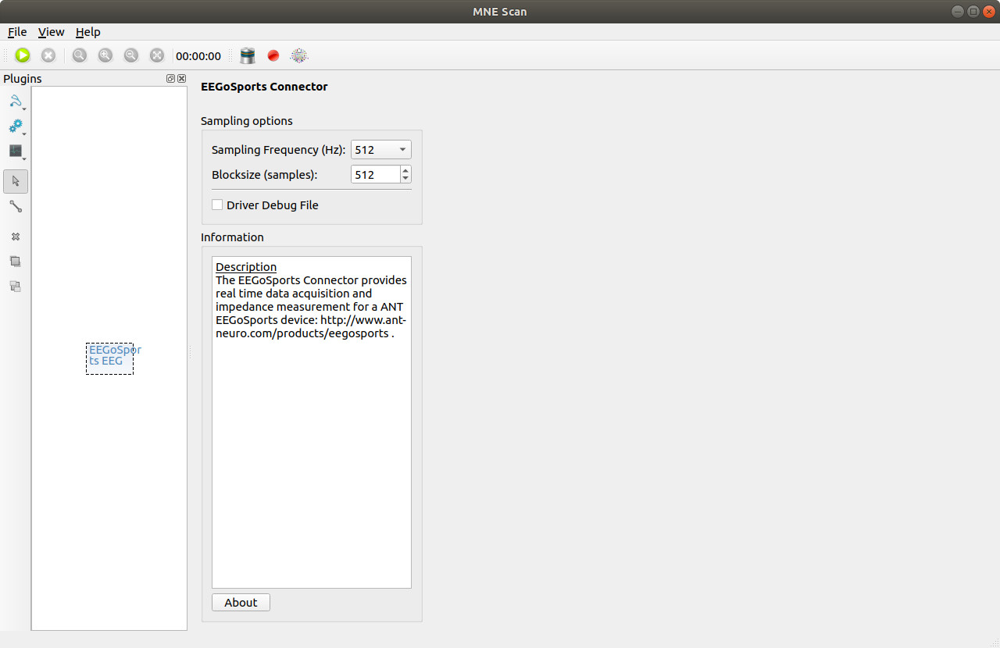

# EEGoSports

This page describes the installation and usage of the EEGoSports driver plugin for MNE Scan.

## Building the EEGoSports Plugin

In order to build the EEGoSports driver plugin, the `eemagine` folder from the SDK has to be added to the EEGoSports folder in the mne-cpp repository in a first step. This location can be found in the mne-cpp repository under:

`\mne-cpp\applications\mne_scan\plugins\eegosports\`

The `eemagine` folder includes another folder called `sdk` which holds the necessary header and source files like: `amplifier.h, buffer.h, channel.h, exceptions.h, factory.h, stream.h, version.h, wrapper.cpp` and `wrapper.h`.

In a second step, the eegosports subproject has to be reintegrated into the mne-cpp project. This can be achieved by adding `MNECPP_CONFIG += withEego` in the `mne-cpp.pri` file.

Now, the whole EEGoSports plugin can be rebuilt. MNE Scan will then contain the EEGoSports plugin in its Sensor plugin section.

## Running the EEGoSports Plugin

For a correct recognition of the EEGoSports device, the operating system compatible driver has to be installed with the delivered software. Furthermore the two files `eego-SDK.lib` and `eego-SDK.dll` from the driver's library have to be copied to the location:

`\mne-cpp\out\Release\apps\`

In a last step, for older SDK versions the license files which are delivered with the device have to be copied to

`C:\Users\Username\Documents\Eego`

The license files should be named like `EE225-020032-000001`.

For recent versions of the SDK, this step is not necessary.

After that, the device can be connected to the computer and be switched on and MNE Scan can be started. It is now possible to use the EEGoSports plugin in the MNE Scan environment. Via drag & drop the plugin can be added to the plugin box and connected to other processing items like shown in the following figure.

The GUI of the EEGoSports EEG plugin allows the adjustment of sample frequency and block size. A FIFF-data-stream is now streamed to the real-time display and subsequenty connected plugins.

Besides the electrode measurements, the FIFF-data-stream additionally contains one channel for the reference electrode, the trigger channel, and the sample count channel.

## Impedance Measurements

Selecting the  symbol opens the widget for impedance measurements.

To display the electrode positions, the correct electrode layout has to be loaded via `Load Layout`. This file has to be in the `ELC` format and must contain the electrode labels and positions in the order, in which they are transmitted to the amplifier (see amplifier/eeg cap documentation).

At the end of the list of electrodes, the positions of reference and ground electrodes should be added with the labels `REF` and `GND`.

Two options exist for the color coding of the impedance values:

* For `Threshold`, green color indicates an impedance value below the selected threshold, yellow color an impedance value below double the selected thresold, orange color an impedance value below three times the selected threshold, and dark red color an even higher impedance value.

* For `Colormap`, the electrodes impedances are color-coded following a `Jet` colormap with the maximum of the colormap at the selected value.
