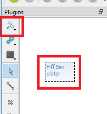
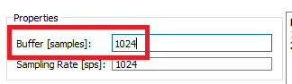
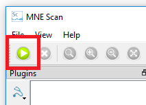

# Stream Pre-Recorded Data

Follow these steps to playback recorded data through the MNE Rt Server to MNE Scan.

* Pass the path to the file you would like to stream via the `-f` or `--file` command line argument. For example: `mne_rt_server --file ../data/MNE-sample-data/MEG/sample/ernoise_raw.fif`. 
* Alternativley, you can navigate and edit to the `FiffSimulation.cfg` file manually. Open the `mne-cpp\resources\mne_rt_server_plugins\FiffSimulation.cfg` with a text editor and insert the path and file name of the fif file which you want to stream. For example: `simFile = ../data/MNE-sample-data/MEG/sample/ernoise_raw.fif`
* Start the mne_rt_server `mne-cpp\bin\mne_rt_server`
* Start MNE Scan `mne-cpp\bin\mne_scan`
* Select the `FiffSimulator` plug-in and place it on the plug-in scene. 

* Click on the `FiffSimulator` plug-in and select the `Connection` tab. If you have started the `mne_rt_server` on your local machine, use IP `127.0.0.1` and press `Connect`. The status should change to `Connected`.
* Click on the `FiffSimulator` plug-in and select the `Preferences` tab. We recommend to use the same block size as the sampling frequency. This way the data will be refreshed every second. 

* Press the green play button in the left upper corner.

* If you click on the `FiffSimulator` plug-in you should now see the real-time data display.