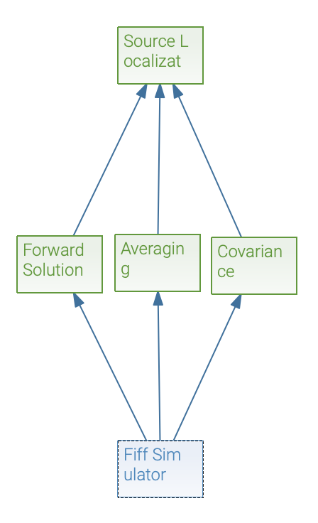
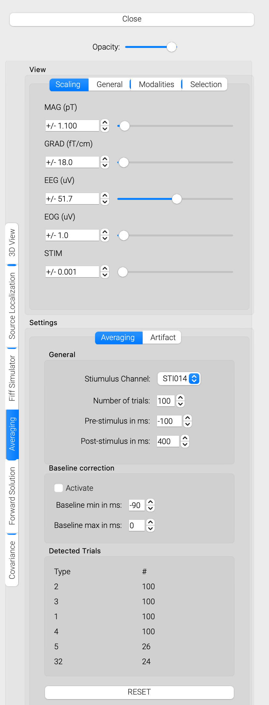
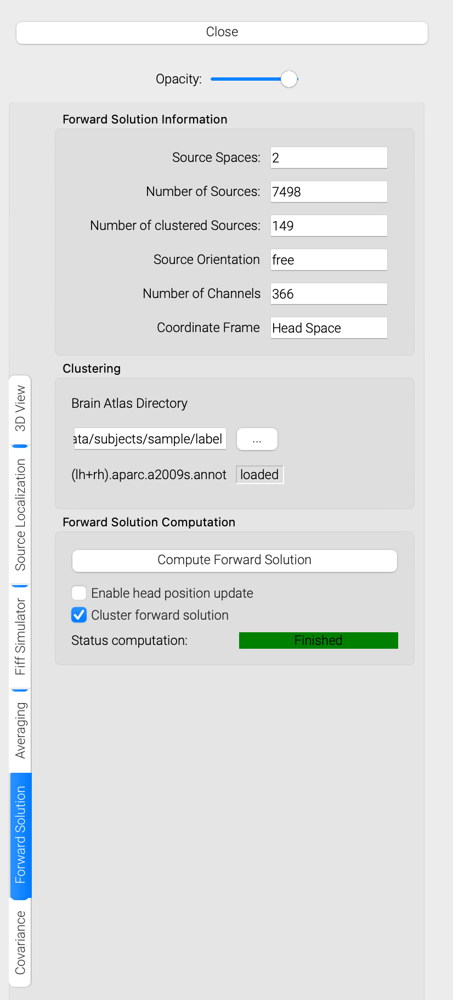
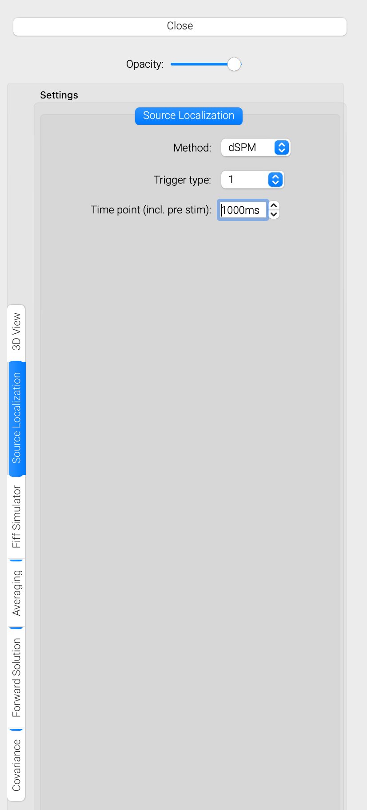
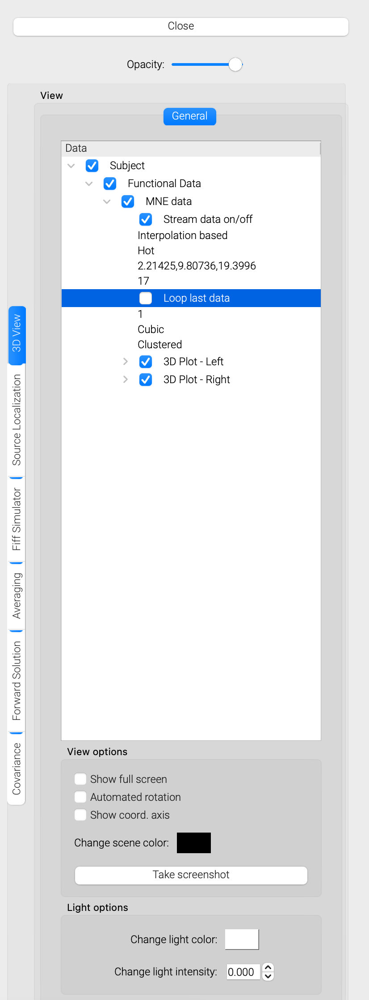

# Real-time Source Localization

This tutorial will show how you can set up an acquisition and real-time source localization pipeline in MNE Scan.

* Make sure you correctly [setup the MNE Sample Data Set](../download/sample_data.md). On MacOS please make sure that you copied the MNE-Sample-data-set to mne_scan.app/Contents/MacOS/ as well.
* Start mne_rt_server in your mne-cpp/out/Release folder.
* Start mne_scan in your mne-cpp/out/Release folder.
* Navigate to the "Sensor Plugins" and "Algorithm Plugins" buttons in the plugin window. Select and position the following plugins onto the plugin scene:
    * Sensor Plugins - FiffSimulator
    * Algorithm Plugins - Averaging
    * Algorithm Plugins - Forward Solution
    * Algorithm Plugins - Covariance
    * Algorithm Plugins - MNE
* Select the "Connection tool" in the plugin window. Connect the plugins as follows by left clicking on the start, holding and releasing above the target plugin.

* Click on the Fiff Simulator plugin and press the "Connect" button.
* Start the pipeline via the green "Play" button in the top left corner.

Now that you should see the different views for each plugin displaying the incoming data, averages and so on. 

* Click on the Averaging plugin.
    * Choose the correct trigger channel. For example STI014 when streaming the default file sample_audvis_raw.fif.
    * Once the averages are starting to come in you can take a look at the averaged data in form of a butterfly and 2D layout plot.

* Click on the Forward Solution plugin.
    * Make sure that the "Cluster forward solution" box is checked.
    * Press the "Compute Forward Solution" button. 
    * Wait until the "Status computation" label shows a green Finished. Computing the forward solution may take some time. However, this only has to be done once.

* Once the forward solution was calculated, the source localization plugin controls should appear in the QuickControlView. Select the plugin.
    * Choose the source localization method, trigger type and time point you want to visualize. If you set the time point outside the range of the computed average (e.g. 1000ms), the data will be streamed sample by sample.

* You can change the 3D visualization setting by selecting the "3D View" plugin controls in the QuickControlView. 
    * If you prefer cortically constrained interpolation you can switch from "Annotation based" to "Interpolation based".
    * The threshold of the plotted activation can be changed by clicking on the field with the three floating values. This will open a histogram based thresholding widget. Use the left, middle and right mouse buttons to set the threshold values.

