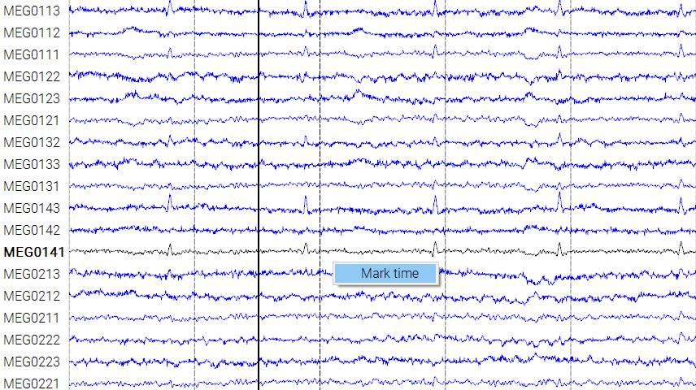
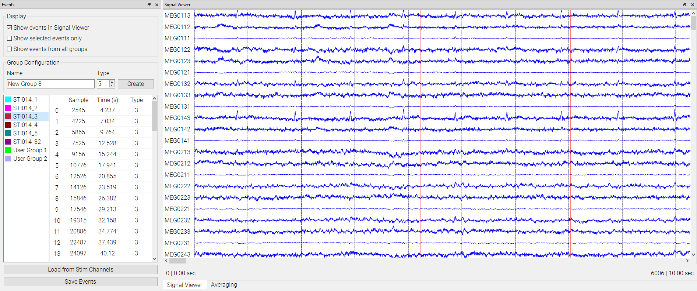

# Annotation Manager

The annotation manager is used to create, display, and save annotations. To add an annotation, right click on the data plot in the spot you wish to add, and select the `Mark time` option.

Added annotations will be displayed in the Annotation Manager widget. From here the annotations can be grouped by user defined types, color coded, and have their sample or time values adjusted.

The save to file button will save the annotation in `.eve` format.
