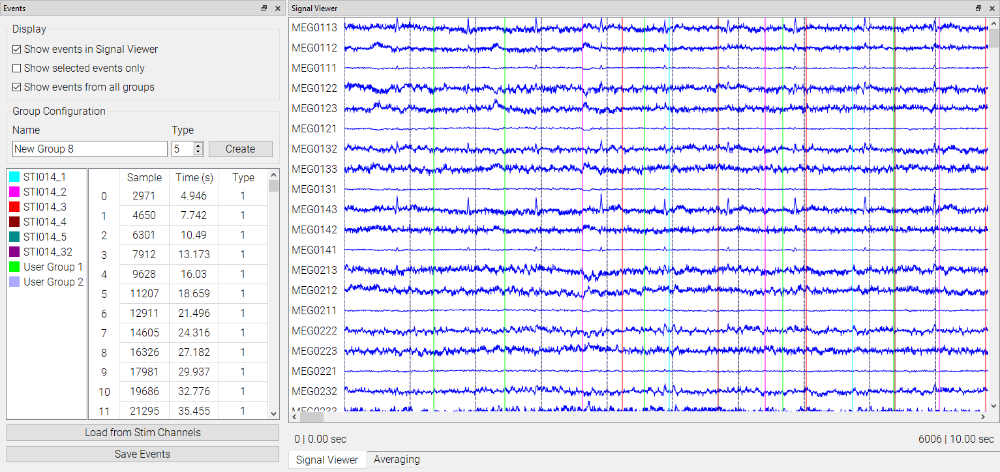
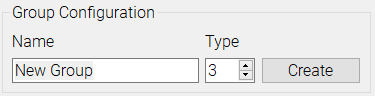
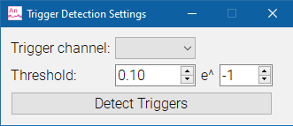

# Event Manager

The event manager is used to create, display, and save events. Events in MNE Analyze are sorted into event groups, each with an associated name, type, and color. Events and event groups can either be manually added or detected from stim channels of the currently loaded file.

### Adding Events Manually

To add an event group, select a name and type for the group and press `Create`. Select a color when prompted.

To add an event, right click on the data plot in the spot you wish to add, and select the `Mark time` option. The event will be added to the currently selected group.

### Adding Events from Stim

Click the `Load from Stim Channels` button to bring up the Trigger Detection widget.

Select the channel from which to load events, and a threshold for detecting triggers.

Press `Detect Triggers` to load in events. This may take a few seconds depending on how many events are being loaded.

### Managing and Viewing Events

Event groups will be added to the left side of the event table. The right side will display the events in the currently selected event group. Event groups can be renamed, recolored, or deleted by right clicking them and selecting the corresponding action.

The display of events can also be narrowed or broadened. Checking `Show selected events only` will make only the currently selected events display in the Signal Viewer. Checking `Show events from all groups` deselects all groups and shows all events at once in the right side of the table and the viewer.

To save the events currently showing on the right side of the table to an `.eve` file, press `Save Events`.
