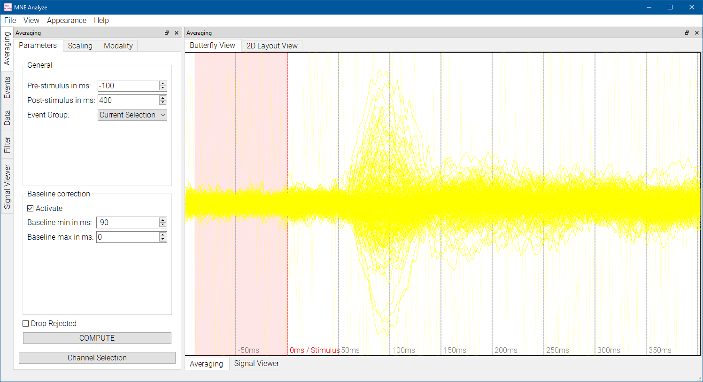
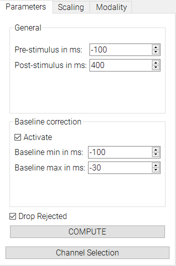

# Averaging

The averaging plugin lets you compute averages based on events.

You can select from any of the existing event groups, or use your current event selection.

Use the `Parameters` tab to input your desired settings and hit the `COMPUTE` button. Prestimulus, poststimulus, and baseline min/max are all relative to the events. `Drop Rejected` will discard data points with artifacts"

You can control which channels to display using the Channel Selection plugin, which lets you select from presets or choose your own selection.
