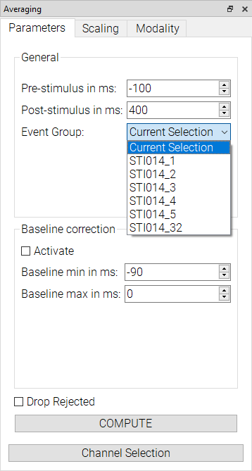

#Averaging

The averaging plugin lets you compute averages based on created annotations. To do this, first create annotations for the points which are to be averaged, like in the figure below:

Next, using the `Parameters` tab of the Averaging plugin, input your desired settings and hit the `COMPUTE` button.
Prestimulus, poststimulus, and baseline min/max are all relative to the set annotations. `Drop Rejected` will discard data points with artifacts"

You can control which channels to display using the Channel Selection tool, which lets you select from presets or choose your own selection.

Make sure to select the correct layout from the bottom left dropdown.
