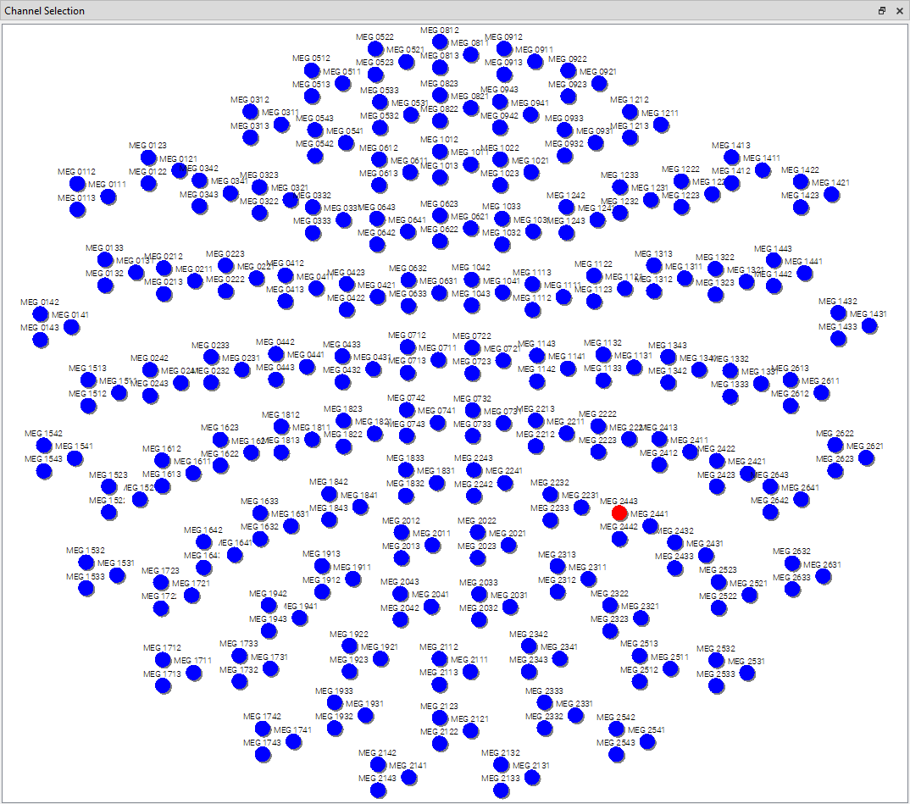
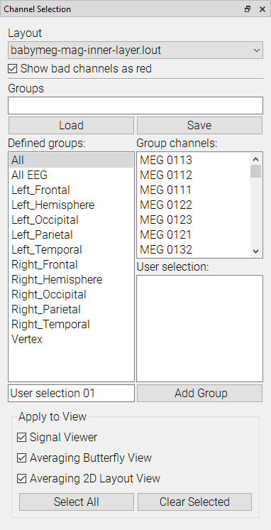

# Channel Selection

This plugin lets you select which channels will be visible in the views of MNE Analyze.

Using the Channel Selection View, you can manually select which channels will be displayed, by either clicking individual channels or dragging a selection box around them.
For this to work correctly, make sure the correct layout is chosen in the dropdown at the top of the controls, so that the view corresponds to the channels in the acquisition device used.

From the controls you can select from premade selection groups, or define your own. You can also load and save selection groups, with more provided in `resources/general/selectionGroups`. You can then select which views the channel selection will be applied to using the checkboxes at the bottom.
