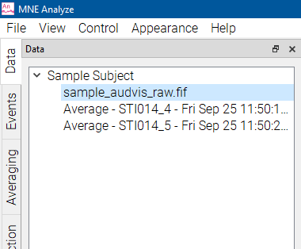
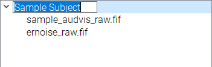
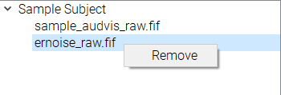

# Data Manager

The Data Manager keeps track of the files in MNE Analyze.

Loaded files from the Data Loader will be added here. The files are grouped into subjects, which can be renamed by double clicking the name and inputting a new one.

Files can be removed by right clicking and selecting `Remove`.

You can select between them to pick which one to display in the [Data Viewer](analyze_rawdataviewer.md).
