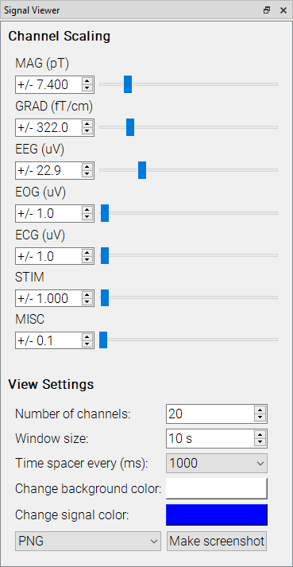

# Signal Viewer

The signal viewer controls the plotting and displaying of the currently selected data file. It is separated into two components: the control widget and the viewer

The control widget allows for defining the plotting and display parameters.

The top set of control sliders define the channel plotting range for each type of channel. It is used for scaling the plotted data. The bottom set of controls is used for controlling channel display parameters, like window size, spacers, number of channels. Signal and background colors can also be adjusted. Screenshots can be taken of the current viewer window.

The viewer portion plots the data and annotations, controlled by the [Annotation Manager](analyze_annotationmanager.md)
