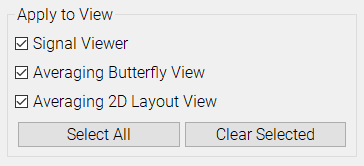

#Scaling

This plugin controls the scaling for all of the views in MNE Analyze.

Use the sliders to select scaling parameters for the different channel types.

Use the checkboxes to control which views to control with the sliders.
