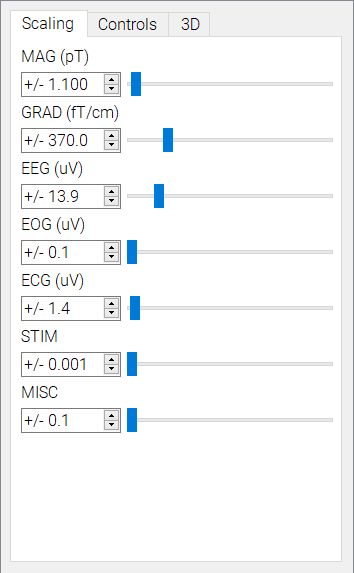
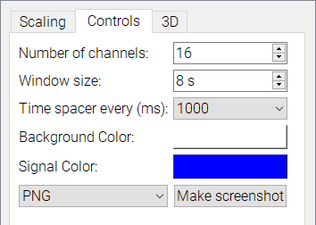

#Settings

This plugin controls the scaling and view settings for all of the views in MNE Analyze.

Use the sliders in the Scaling tab to select scaling parameters for the different channel types.

Use the Controls tab to select view settings.

Use the checkboxes to control which views to control with the sliders.
