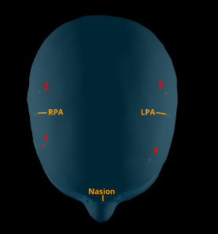
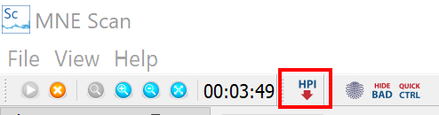
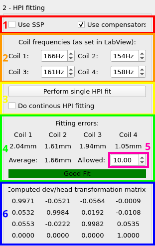
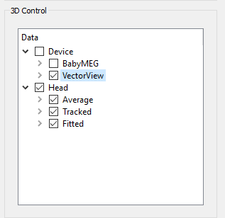

# Real-time Head Monitoring

This guide gives introductions on how to enable and use real-time head monitoring during your measurement. Prerequisites are enabled head position indicator (HPI) coils. These are coils, driven at a specific frequency, that help to estimate the current head position. 

## Prerequisite

Before you can visualize the head movement during your measurement, you have to ensure two things:

1. Enable continuous HPI (cHPi) during your measurement.
2. Make sure you have digitized the subjects head accordingly and you have access to the data. Be aware of the order you digitize the subject's HPI coils. The following picture shows in wich order MNE-CPP assigns the head positions. Try to stay consistent.

## Setup

The HpiView is a functionality that can be added to all Sensor Plugins like `FiffSimulator` or `FieldTripBuffer`. The following steps will show you everything necessary to set up the real-time head monitoring. 

1. Setup Datastream
    * Streaming Simulated Data via [FiffSimulator](/prerecordeddata.md).

    * Streaming data from a MEG device in real-time, i.e. with the [FieldTripBuffer-Plugin](../development/ftbufferplugin.md).

2. Open the HPI View

    The `HPI` Icon appears after you clicked on the Sensor Plugin. To Open the HPI View click on this Icon.

    

## The HPI View

The HPI-View panel can be divided into two sections, namely the monitoring section and the control section. The monitoring sections show an average head model that is aligned and scaled to tracked landmarks like LPA, RPA, Nasion and HPI coils. 

The control panel is on the right side and can also be divided into several sections. How to use them and what you can control with them is shown below.    

### Load Digitizers

* Click the button `Load Digitizers` and navigate to the subjects digitized data which is stored in `.fif` format.  
* The display will show how many digitizers of each kind are loaded. 

### HPI-Fitting

1. Choose if you want to use:
    * Signal Space Projection `SSP`
    * `Compensators`

2. Enter the HPI coil frequencies. The labeling 1,2,3,4 refers to the positions mentioned at the beginning of this guide.

3. Do an initial HPI fit or enable continuous HPi fitting. 

4. The Error in mm is shown for each coil and on average. The error is namely the distance between the calculated his position and the digitized his position. 

5. Choose a threshold that defines until which error the calculated HPI-fit should be applied. 

6. The calculating device to head transformation matrix is also shown.

### 3D-Control

Here you can choose what elements you want to visualize in the monitoring section. These elements are the following:

 * Device: `VectorView` or `BabyMEG`
 * Head: `Average` and `Tracked`
 
In `Head` you can choose if you want to see the scaled average head visualization and tracked digitizers. In `Device` if and which sensor layout you want to visualize.