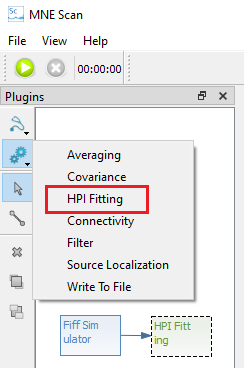
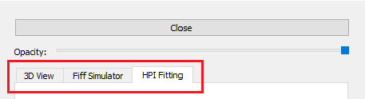
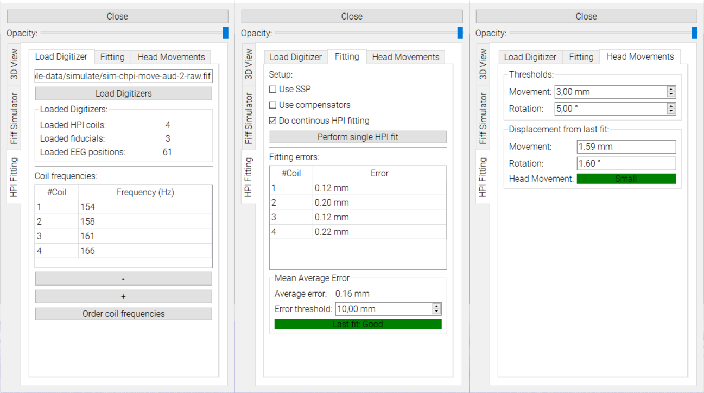

# Real-time Head Monitoring

This guide shows how to enable and use real-time head monitoring during a MEG measurement. Currently, only Neuromag/Elekta/MEGIN devices are supported.

## Prerequisites

Before you can monitor head movements during a measurement, ensur eyou have the following things setup:

1. Enable continuous HPI (cHPi) during your measurement.
2. Make sure you have digitized the subjects head (fiducials, HPI coils and additional head points) and you have access to the data. 

## Setup

Real-time head monitoring works in combination with sensor plugins, such as the `FiffSimulator` or `FieldTripBuffer`. The following steps guide you through setting up the real-time head monitoring in MNE Scan: 

1. Setup the data stream. You can either:
    * Stream pre-recorded data via the [FiffSimulator plugin](/prerecordeddata.md).
    * Stream data from a MEG device connected via the [FieldTripBuffer plugin](../development/ftbufferplugin.md).

2. Add the HPI Fitting plugin to the plugin scene and connect your sensor plugin from step one to the HPI Plugin.

   

3. Start the measurement via the Play button in the top left corner

4. You can open and control the settings for the HPI fitting via the Quick Control View. Open it by pressing the `QUICK CTRL` button and follow the steps described in the next section.

    

MNE Scan should now look like following picture. You have the plugin scene on the left, the 3D View in the upper part and the data stream in the lower part. The 3D View shows an average head model that is aligned and scaled to digitized landmarks like LPA, RPA, Nasion and HPI coils. The head moddel shows up after the first succesfull HPI fit. 

## The Quick Control View

The Quick Control View can be used to choose between different tabs, where every tab correspondds to one plugin. In case of a basic HPI Fitting pipeline, there should be three tabs: FiffSimulaotr or FieldTripBuffer, HpI Fitting andd 3D View.

{:height="300px"}

The HPI Fitting and 3D View tabs and their functionalities are described in the following:

### The HPI Fitting tab

1. Click the button `Load Digitizers` and navigate to the subject's digitized data which is stored in `.fif` format.  
2. The display will show how many digitizers of each kind were loaded. 

    

3. Enter the HPI coil frequencies. You can add and remove frequencies. 

    

4. Choose if you want to use `Signal Space Projection` (`SSP`) or `Compensators` when performing the fit.
5. If you don't know how your coils and frequencies are ordered, do an initial frequency ordering by pressing `Order coil frequencies`.
6. Do an initial HPI fit or enable continuous HPI fitting. Make sure you have started the measuring pipeline via the play button first. After the first succesfull fit the average head should appear in the 3D View.
7. The `Fitting errors` are shown in mm for each coil and as an average over all coils. The error is calculated as the distance between the estimated HPI coils and the digitized HPI positions.
8. Choose a threshold that defines an acceptable error. 

### The 3D View tab

Here you can choose what elements you want to visualize in the monitoring section. These elements include:

* Device > `VectorView` or `BabyMEG` features the helmet surfaces for different MEG devices.
* Head > `Average`, `Tracked` and `Fitted` features the averaged head surface, digitized and aligned landmarks as well as the estimated HPI coil locations, respectivley.