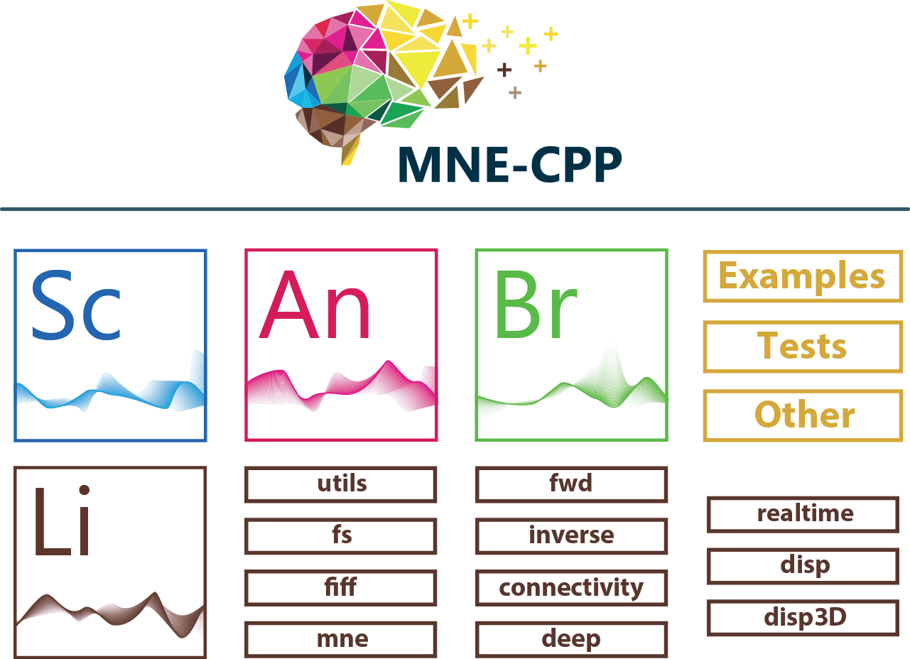

MNE-CPP is designed as a two-layer framework. The library layer (Li) provides the core functionalities, which can be used during development and loaded by applications during runtime. The stand-alone applications, examples and tests are realized within the application layer of MNE-CPP. As a stand-alone software, MNE Scan (Sc) is part of the application layer and makes use of the functionality of the library layer. Also, we use a so-called Clone-and-Own approach of the Eigen library, which is integrated in our repository. Qt provides tools for GUI creation whereas Eigen provides mathematical operations for linear algebra.

Below are some guides to get you stated with MNE-CPP. You can also use our [documentation](https://mne-cpp.github.io/doxygen-api/index.html) to guide you.
