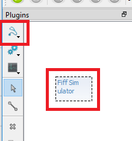

# Stream Pre-Recorded Data

Follow these steps to playback recorded data through the MNE Rt Server to MNE Scan.

* Navigate to the `FiffSimulation.cfg` file in your MNE-CPP install directory, e.g., `mne-cpp\bin\resources\mne_rt_server_plugins\FiffSimulation.cfg`.
* Open the `FiffSimulation.cfg` with a text editor and insert the path and file name of the fif file which you want to stream. For example: `simFile = mne-cpp\bin\MNE-sample-data\MEG\ernoise_rawsample.fif`
* Save and close the `FiffSimulation.cfg` file
* Start the mne_rt_server `mne-cpp\bin\mne_rt_server`
* Start MNE Scan `mne-cpp\bin\mne_scan`
* Select the `FiffSimulator` plug-in and place it on the plug-in scene. Make sure to delete all other plug-ins on the stage.

* Click on the `FiffSimulator` plug-in and set the wanted buffer size. We recommend to use the same block size as the sampling frequency. This way the data will be refreshed every second. 

* Press the green play button in the left upper corner.

* If you click on the `FiffSimulator` plug-in you should now see the real-time data display.