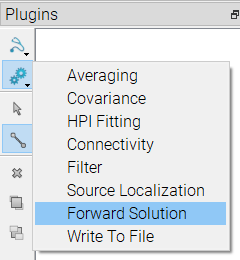
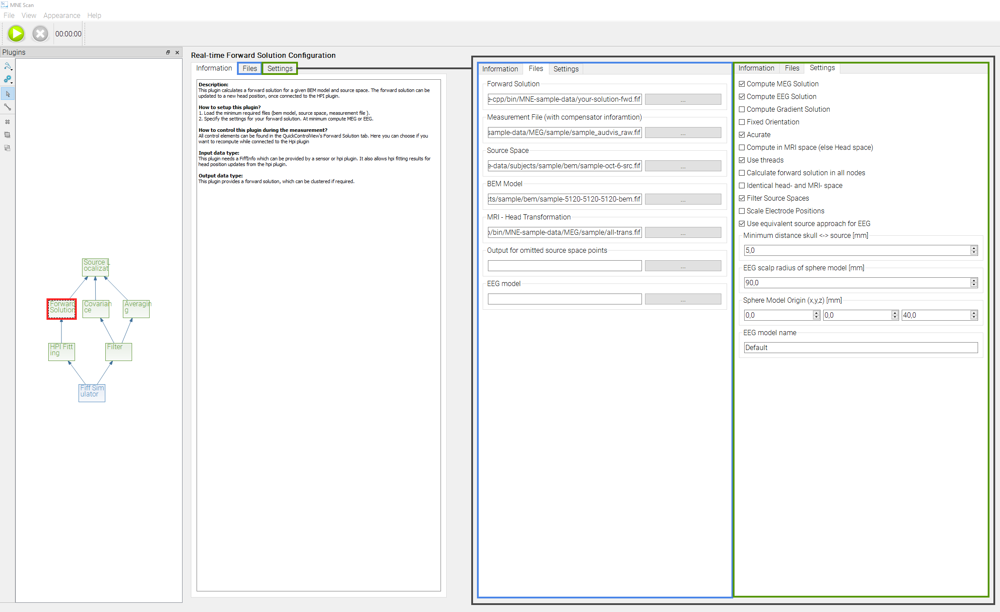
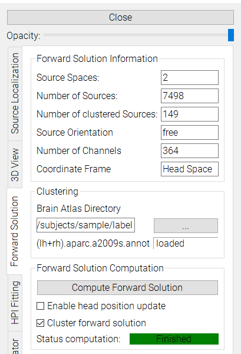
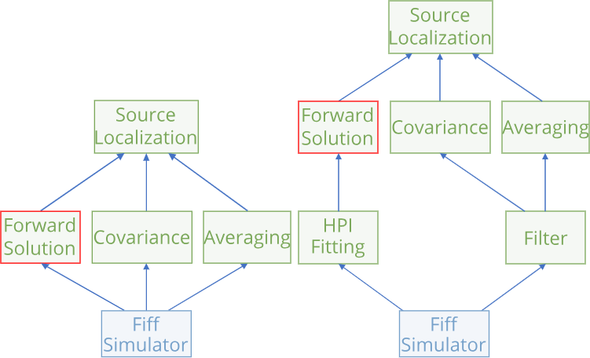

# Forward Solution Plugin

The forward solution plugin handles all forward computation tasks within MNE Scan. It can be used to compute the EEG and MEG forward solution, based on a BEM and source model. The functionality is consistent to [MNE Forward Solution](/fwdsolution.md). Further, it is possible to update the MEG forward solution to a new head position provided by the [HPI Fitting plugin](/scan_heamonitoring.md).

## Input

The Forward Solution plugin takes data from following plugins:
* Sensor Plugins: [FiffSimulator plugin](/scan_prerecordeddata.md), [FieldTripBuffer plugin](../development/)
* [HPI Fitting plugin](/scan_heamonitoring.md)

## Output

The computed forward solution can be passed to the [Source Localization plugin](/scan_sourceloc.md).

## Setup

1. Load the Forward Solution Plugin from the Algorithm Plugins available in MNE Scan

2. To compute the forward solution within MNE Scan, some files and settings have to be loaded respectively set before the start of the measurement. The settings and files are the same as described in [MNE Forward Solution](/fwdsolution.md). They can be accessed by clicking on the Forward Solution plugin in the Plugin Scene. 

| **Please note:**  The measurement file can be an arbitrary measurement file observed on the System of choice. It is only used to extract the system-specific compensator data.|

If not specified, the BEM model defaults to a sphere model.

## Forward Solution Computation

Once the settings are specified, and the aspired pipeline is designed, the measurement can be started. 

3. Open the control widget.  

4. Navigate to the `Forward Solution` tab. 

| **Please note:**  If connected to the HPI Fitting plugin, the Forward Solution control widget first appears after the first successful HPI fit.|

5. Compute the forward solution by pressing `Compute Forward Solution`.

6. To pass the forward solution to the Source Localization plugin, it is necessary to enable the checkbox `Cluster Forward Solution`.

7. If connected to the HPI Fitting plugin, it is possible to activate `Enable head position update` to update the forward solution once the defined thresholds within the HPI Plugin are exceeded. 

| **Please note:**  This is not yet real-time capable. The forward solution computation takes some seconds. Therefore it is wise to choose the thresholds not too small.|

## Pipelines 

In the following picture, some examples for processing pipelines, including the Forward Solution plugins, are presented. 

The pipeline on the left represents an easy source localization pipeline, whereas the right one can be used to compensate head movements during the measurement. The current head position, estimated by the HPI Fitting plugin, is used to update and recompute the forward solution. For this pipeline, it is further necessary to filter out the cHPI data before averaging. For further guides on setting up the components see:

* [HPI Fitting plugin](/scan_heamonitoring.md)
* [Source Localization plugin](/scan_sourceloc.md).
