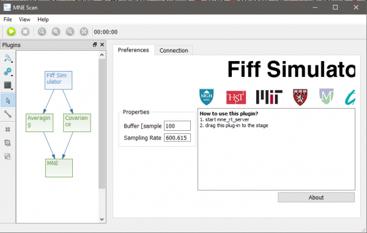
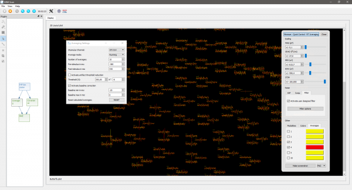
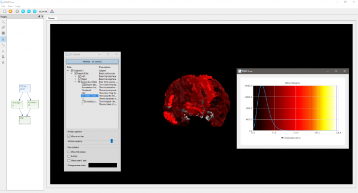

# Setup real-time source localization example

|**Please note:** The information provided on this page might be outdated and will be updated soon.|

This tutorial will show how you can setup an acquisition and processing chain in MNE Scan, which makes use of the real-time source localization method RTC-MNE.

The following steps will show you how to setup the online processing pipeline in MNE Scan:

1. Make sure you downloaded and correctly extracted the MNE Sample data set. If not, check for a step by step guide here. On MacOS please make sure that you copied the MNE Sample data set to mne_scan.app/Contents/MacOS/ as well.
2. Start mne_rt_server in your mne-cpp/bin folder. It is important that the mne_rt_server is started before the mne_scan executable.
3. Start mne_scan in your mne-cpp/bin folder.
4. Navigate to the Sensor Plugins and Algorithm Plugins buttons in the plugin window. Select and position the following plugins onto the plugin scene:
 * Sensor Plugins - FiffSimulator
 * Algorithm Plugins - Averaging
 * Algorithm Plugins - Covariance
 * Algorithm Plugins - MNE
5. Select the Connection tool in the plugin window. Connect the plugins as follows by left clicking on the start, holding and releasing above the target plugin.

6. Click on the MNE plugin and wait until the Start Clustering button is clickable again.
7. Click on the Fiff Simulator plugin.
8. Start the pipeline by clicking on the green play button in the left upper corner.

Now that you setup and are running the data acquisition/processing pipeline, we can start to configure some parameters for the online processing:

1. Click on the Averaging plugin.
 * Click on the Averaging Adjustments button in the toolbar.
 * Choose the correct trigger channel. Since we are making use of the MNE-Sample-Data-Set choose STI014.
 * Once the averages are starting to come in you can take a look at the averaged data in form of a butterfly and 2D layout plot.

2. Click on the MNE plugin.
 * Select the 3D Control from the toolbar.
 * Navigate to the Data item.
 * Now click on the item with the description "The value to normalize the source localization result".
 * You should be prompted with the histogram based thresholding window. Use the right, middle and left mouse button to set the thresholds.
 *  The 3D view can be rotated using the middle and translated using the right mouse button.

