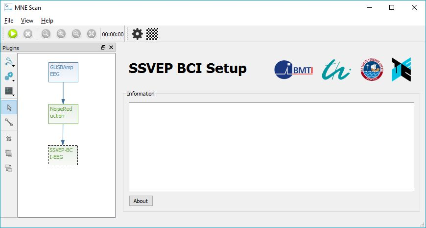
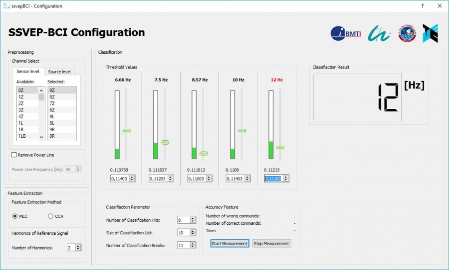
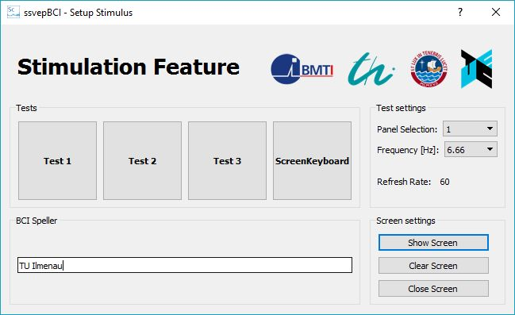

# Setup SSVEP BCI example

|**Please note:** The information provided on this page might be outdated and will be updated soon.|

## Introduction

The SSVEP-BCI plugin beholds a Brain Computer Interface (BCI) using Steady-State-Visual-Evoked-Potentials (SSVEP). It was developed under the Master Thesis "[Development of a BCI based on real-time neural source localization](http://opac.lbs-ilmenau.gbv.de/DB=1/SET=2/TTL=1/CMD?ACT=SRCHA&IKT=1016&SRT=YOP&TRM=Development+of+a+BCI+based+on+real-time+neural+source+localization){:target="_blank" rel="noopener"}", in which the so called [Bremen-BCI](http://iopscience.iop.org/article/10.1088/1741-2560/8/3/036020/meta){:target="_blank" rel="noopener"} was used as a role model in order to setup classification pipeline and visualization. This tutorial describes both the setup of the processing pipeline and usage of the SSVEP-BCI plugin.

## Editing the processing pipeline

In the following figure an edited setup of the SSVEP-BCI processing pipeline is shown in the MNE Scan GUI environment. For this example the NoiseReduction plugin was interposed as a preprocessing step in order to increase the Signal-to-Noise ratio. However, the SSVEP-BCI plugin can also be processed with "raw" (unfiltered) data by connecting it directly with the acquisition plugin.

## Adjusting the SSVEP-BCI

Like already mentioned, in the thesis "[Development of a BCI based on real-time neural source localization](http://opac.lbs-ilmenau.gbv.de/DB=1/SET=2/TTL=1/CMD?ACT=SRCHA&IKT=1016&SRT=YOP&TRM=Development+of+a+BCI+based+on+real-time+neural+source+localization){:target="_blank" rel="noopener"}" different scientific approaches are combined in order to realize this BCI. The adjustment of these features can be done by clicking the configuration icon: on the SSVEP-BCI's GUI which is depictured in the previous figure. With this command, the configuration GUI is opened which is shown in the following figure.

The adjustments can be done online during the processing of the plugin with the configuration GUI:

### Channel select

The channel select is realized with a .txt-file which is located under "MNE-CPP Folder-bin-mne_scan_plugins-resources-ssvepBCI", like the already included "Pinning-Scheme-Duke-Dry-64.txt" file. These files behold the mapping of the channel names according to the channel number in the FIFF-file. You can change the current selected folder or link the plugin to a new edited file. In the latter case, the new edited file-name has to be changed in line 241 of the "ssvepbciconfiguration.cpp" file. Also the default channels can be changed in the ssvepbci.cpp file in line 104 and 106. Now the channel can be selected or deleted by drag&drop between the available- and delete-section.

### Feature extraction

The feature extraction can be realized with either the MEC or the CCA algorithm. Both approaches are described in the corresponding thesis. Also the number of generated harmonics of the reference signal can be set in this frame.

### Classification

The state of classification is displayed with five different progress bars belonging each to a different SSVEP frequency. The thresholds can be set with the double-spin-boxes by moving the slider (threshold) up and down.

For a classification indeed to be confirmed, the classification has to be done several times in a sliding list. Following parameter can be set for this process:

 * **Number of Classification Hits**: is the minimal number of classification hits until there is a confirmation.
 * **Size of Classification**: is the size of possible entries in to the classification list. By logic, this value is always bigger or equal than the "Number of Classification Hits".
 * **Number of Classification Breaks**: Since there are a lot of subject dependent variations, the algorithm needs to be paused between two classifications. Therefore a number of classification breaks can be set with this parameter.

If a classification has been confirmed, its name will be displayed red and also can be seen in the LCD-number field.

### Accuracy feature

In order to determine accuracy and robustness of the plugin, a measurement can be started with the screen keyboard device. For this purpose a Measurement can be started and stopped in the corresponding frame. However, the screen keyboard has to be set before which is explained in the following section.

## Adjusting the stimulation

For stimulation, a second screen hast to be attached to the control computer. Performance issues in the visualization of the stimulation are mostly the consequence of old graphic drivers. Since challenging graphical tasks are performed, the latest graphic driver should be installed on the operating system.

The BCI then will adapt automatically to the adjusted frequencies. The configuration of the stimulation can be set by clicking the stimulation icon: . Consequently, the window for setting the stimulation opens.

"

Three tests can be started by clicking the associated buttons. Every test beholds different numbers of flickering panels with a different size. Each panel can be selected with the first combo box. With the second combo box, the frequency of the selected panel can be adjusted. Below of the combo boxes, the refresh rate of the subject's screen is displayed. If the stimulation screen is shown on the wrong monitor, the screens' numbers have to be exchanged in the main settings of the operating system.

The fourth button initializes the visualization of the screen keyboard device. In the group box "BCI Speller" a short phrase can be set in order to show to the subject in reinitialize the accuracy feature. In this example the chosen phrase is "TU Ilmenau". By clicking the button "start measurement" in the SSVEP-BCI configuration window. A measurement can be started then.

## Handling of the screen keyboard

The Screen Keyboard is a special application for SSVEP-BCIs which was designed for the [Bremen-BCI](http://iopscience.iop.org/article/10.1088/1741-2560/8/3/036020/meta){:target="_blank" rel="noopener"}. Following figure shows the surface of the subject's screen.

"

The subject can control the Screen Keyboard by concentrating of the four direction- and the "Select" panel. The BCI recognizes the selected command and translates them to the red cursor in the middle of the screen. The bottom left corner shows the phrase which is supposed to be spelled. This phrase can be set with the stimulation feature. The accuracy feature then will count the amount of right and wrong commands.
