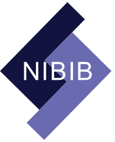
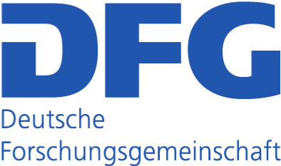
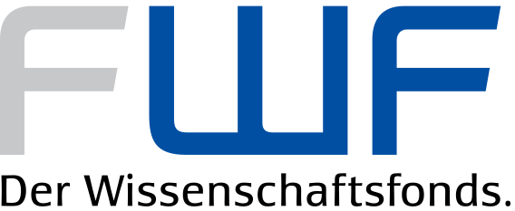

# Projects and Funding

At present, there are several projects funded by NIH and and European funding agencies, which capitalize on MNE-CPP. While these projects benefit from the existing resources in MNE-CPP, they all also contribute to MNE-CPP, making the framework more comprehensive.

| Acronym | Duration | Description |
|-------|-------|-------|
| MNE-CE | 2017-2022 | Throughout the MNE CE research project (1U01EB023820) the main goal is to create a device independent and standardized software for acquiring, controlling and processing electrophysiological data in real-time. The MNE CE project has a total duration of five years with another five years of possible extension, sponsored by the National Insitutes of Health (NIH). |
| OCE | 2018-2021 | The proposed project (397686322) with the title “Online Neuronal Connectivity Estimation and Neurofeedback with Transcranial Magnetic Stimulation” will establish new real-time methods to analyze and process MEG/EEG data for subsequent cortical stimulation scenarios. The overarching objective is to develop real-time computational tools for advancing our understanding of electrophysiological functions of neuronal networks and cortical stimulation in the human brain in health and disease. During the project methods for estimating functional connectivity in real-time MEG/EEG scenarios will be established. Furthermore, ways to integrate Transcranial Magnetic Stimulation (TMS) into a real-time scenario will be investigated. The work will be funded by the Deutsche Forschungsgemeinschaft (DFG) and the Wissenschaftsfonds (FWF). |
| AWS Credits | 2018-2019 | The Amazon Web Services (AWS) Credits for Research Program awarded funding for cloud computing to support the MNE-CPP project. |
| Azure Credits | 2016-2017 2017-2018 | The Microsoft Azure for Research program awarded funding for cloud computing to support the MNE-CPP project. |
| OSL | 2013-2015 | Online localization of neuronal sources in the human brain from single-trial magnetoencephalography (MEG) recently got into focus of neuroscience to clarify brain functionality, identify brain states and to improve real-time applications such as brain-computer interface (BCI) systems. The project (Ba 4858/1-1) with the title "Online MEG Source Estimation using High-Performance GPU Computing" focused on developing and establishing new online source localization techniques. The work was funded by the Deutsche Forschungsgemeinschaft (DFG). |

<html>
   <footer class="footer">
   
   
         
         
      
      
      
      
   

   </footer>
   
</html>