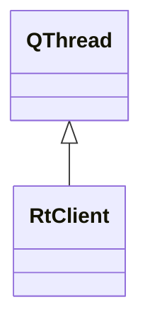

# RtClient

**Namespace:** `COMLIB` &nbsp;·&nbsp; **Library:** Communication Library

`#include <com/rt_client.h>`

```cpp
class COMLIB::RtClient
```

Threaded façade that owns a paired command/data connection to `mne_rt_server` and re-emits streamed buffers.

Constructs and drives both [`RtCmdClient`](/docs/api/com/rt-cmd-client) (port 4217) and [`RtDataClient`](/docs/api/com/rt-data-client) (port 4218) from inside its own ``run()`` loop, handles the initial id/alias/info/buffer-size handshake, and surfaces each received raw buffer as ``rawBufferReceived(Eigen::MatrixXf)`` so consumers in the GUI / acquisition stack never touch the sockets directly. State changes on the underlying TCP connection are mirrored through ``connectionChanged(bool)``.

### Inheritance



---

## Public Methods

### RtClient(p_sRtServerHostname, p_sClientAlias, parent)

Creates the real-time client.

**Parameters:**

- **p_sRtServerHostname** : *QString*
  The IP address of the mne_rt_server.

- **p_sClientAlias** : *QString*
  The client alias of the data client.

- **parent** : *QObject **
  Parent QObject (optional).

---

### ~RtClient()

Destroys the real time client.

---

### getFiffInfo()

Request [Fiff](/docs/api/fiff/fiff-class) Info.

**Returns:**

- *[FIFFLIB::FiffInfo](/docs/api/fiff/fiff-info)::SPtr &* — Reference to the shared pointer holding the measurement info received from the server.

---

### getConnectionStatus()

Rt Server status, returns true when rt server is started.

**Returns:**

- *bool* — true if started, false otherwise.

---

### stop()

Stops the [`RtClient`](/docs/api/com/rt-client) by stopping the producer's thread.

**Returns:**

- *bool* — true if succeeded, false otherwise.

---

## Authors of this file

- Christoph Dinh &lt;christoph.dinh@mne-cpp.org&gt;
