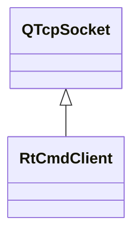

# RtCmdClient

**Namespace:** `COMLIB` &nbsp;·&nbsp; **Library:** Communication Library

`#include <com/rt_cmd_client.h>`

```cpp
class COMLIB::RtCmdClient
```

`QTcpSocket` subclass driving the `mne_rt_server` control channel (default port 4217).

Sends commands in either CLI or JSON form via `sendCLICommand` / `sendCommandJSON`, accumulates replies under an internal mutex so a worker thread can produce while the GUI thread consumes through `readAvailableData`, and mirrors the server’s self-described command vocabulary into an embedded [`CommandManager`](/docs/api/com/command-manager) so callers can look commands up by name without hard-coding their schemas.

### Inheritance



---

## Public Methods

### RtCmdClient(parent)

Creates the real-time command client.

**Parameters:**

- **parent** : *QObject **
  Parent QObject (optional).

---

### hasCommand(p_sCommand)

Checks if a command is managed;.

**Parameters:**

- **p_sCommand** : *const QString &*
  [`Command`](/docs/api/com/command) to check.

**Returns:**

- *bool* — true if part of command manager, false otherwise.

---

### sendCLICommand(p_sCommand)

Sends a command line formatted command to a connected mne_rt_server.

**Parameters:**

- **p_sCommand** : *const QString &*
  The command to send.

**Returns:**

- *QString* — mne_rt_server reply.

---

### sendCommandJSON(p_command)

Sends a command to a connected mne_rt_server.

**Parameters:**

- **p_command** : *const [Command](/docs/api/com/command) &*
  The command to send.

---

### readAvailableData()

Returns the available data.

**Returns:**

- *QString* — the available data.

---

### requestBufsize()

Request buffer size from mne_rt_server.

**Returns:**

- *qint32* — Buffer size in samples reported by the server, or -1 if the response could not be parsed.

---

### requestCommands()

Request available commands from mne_rt_server.

---

### requestConnectors(p_qMapConnectors)

Request available connectors from mne_rt_server.

**Parameters:**

- **p_qMapConnectors** : *QMap&lt; qint32, QString &gt; &*
  list of connectors.

**Returns:**

- *qint32* — the active connector.

---

### waitForDataAvailable(msecs)

Wait for ready read until data are available.

**Parameters:**

- **msecs** : *qint32*
  time to wait in milliseconds, if -1 function will not time out. Default value is 30000.

**Returns:**

- *bool* — [`Command`](/docs/api/com/command) object related to command key word.

---

### operator\[\](key)

Subscript operator [] to access commands by command name.

**Parameters:**

- **key** : *const QString &*
  the command key word.

**Returns:**

- *[Command](/docs/api/com/command) &* — [`Command`](/docs/api/com/command) object related to command key word.

---

### operator\[\](key)

Subscript operator [] to access commands by command name.

**Parameters:**

- **key** : *const QString &*
  the command key word.

**Returns:**

- *const [Command](/docs/api/com/command)* — [`Command`](/docs/api/com/command) object related to command key word.

---

## Authors of this file

- Christoph Dinh &lt;christoph.dinh@mne-cpp.org&gt;
