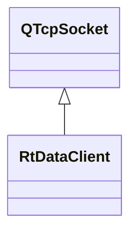

# RtDataClient

**Namespace:** `COMLIB` &nbsp;·&nbsp; **Library:** Communication Library

`#include <com/rt_data_client.h>`

```cpp
class COMLIB::RtDataClient
```

`QTcpSocket` subclass that talks the FIFF wire dialect of the `mne_rt_server` data port (default 4218).

Negotiates the per-session client id with `setClientAlias` / `getClientId`, fetches the `FiffInfo` (and optionally the digitiser point set) via `readInfo` / `readMetadata`, and then blocks on `readRawBuffer` to deliver one `Eigen::MatrixXf` sample matrix at a time. Parsing is delegated to [`FiffStream`](/docs/api/fiff/fiff-stream) / `FiffTag` so this class never re-implements the binary framing; the only socket state it owns beyond the `QTcpSocket` base is the assigned `m_clientID`.

### Inheritance



---

## Public Methods

### RtDataClient(parent)

Creates the real-time data client.

**Parameters:**

- **parent** : *QObject **
  Parent QObject (optional).

---

### disconnectFromHost()

Attempts to close the socket.

If there is pending data waiting to be written, QAbstractSocket will enter ClosingState and wait until all data has been written. Eventually, it will enter UnconnectedState and emit the disconnected() signal.

---

### getClientId()

Requests the ID at mne_rt_server and returns it.

**Returns:**

- *qint32* — the requested id.

---

### readInfo()

Reads fiff measurement information of a data the connection.

**Returns:**

- *[FIFFLIB::FiffInfo](/docs/api/fiff/fiff-info)::SPtr* — the read fiff measurement information.

---

### readMetadata()

Reads fiff metaata class from data connection.

**Returns:**

- *[MetaData](/docs/api/com/meta-data)* — returns metadata class (FiffInfo and FiffDigitizerData)

---

### readRawBuffer(p_nChannels, data, kind)

Reads fiff measurement information of a data the connection.

**Parameters:**

- **p_nChannels** : *qint32*
  Number of channels to reshape the received data.

- **data** : *Eigen::MatrixXf &*
  The read data - ToDo change this to raw buffer data object.

- **kind** : *FIFFLIB::fiff_int_t &*
  Data kind.

---

### setClientAlias(p_sAlias)

Sets the alias of the data client.

**Parameters:**

- **p_sAlias** : *const QString &*
  The alias of the data client.

---

## Authors of this file

- Christoph Dinh &lt;christoph.dinh@mne-cpp.org&gt;
