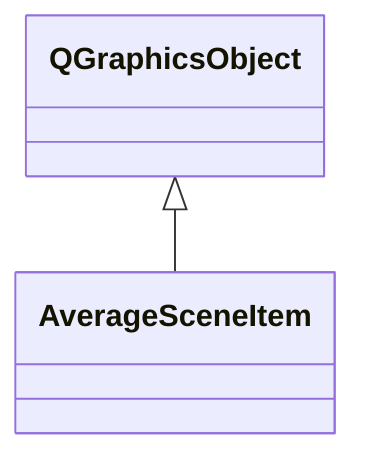

# AverageSceneItem

**Namespace:** `DISPLIB` &nbsp;·&nbsp; **Library:** Display Library

`#include <disp/averagesceneitem.h>`

```cpp
class DISPLIB::AverageSceneItem
```

QGraphicsObject painting one channel's averaged evoked traces inside [`AverageScene`](/docs/api/disp/average-scene).

Stores per-condition data vectors and colours and paints overlaid traces, the t = 0 marker and the baseline inside its bounding rect during `paint()`.

### Inheritance



---

## Public Methods

### AverageSceneItem(channelName, channelNumber, channelPosition, channelKind, channelUnit, color)

Constructs a [`AverageSceneItem`](/docs/api/disp/average-scene-item).

**Parameters:**

- **channelName** : *const QString &*
  Name of the channel shown by this item.

- **channelNumber** : *int*
  Index of the channel in the measurement info.

- **channelPosition** : *const QPointF &*
  Position of the item in the 2-D layout scene.

- **channelKind** : *int*
  FIFF channel kind (e.g. FIFFV_MEG_CH).

- **channelUnit** : *int*
  FIFF unit of the channel data.

- **color** : *const QColor &*
  Default signal colour (default Qt::yellow).

---

### boundingRect()

Reimplemented virtual functions.

**Returns:**

- *QRectF* — Fixed 120 x 60 bounding rectangle centred on the item origin.

---

### mousePressEvent(event)

---

### mouseReleaseEvent(event)

---

### paint(painter, option, widget)

---

### setDefaultColor(viewColor)

Sets the item color to the input parameter viewColor.

**Parameters:**

- **viewColor** : *const QColor &*
  desired item color.

---

## Authors of this file

- Lorenz Esch &lt;lorenz.esch@tu-ilmenau.de&gt;
- Wayne F. Mead &lt;isk@imsorrykun.com&gt;
- Gabriel Motta &lt;gabrielbenmotta@gmail.com&gt;
- Juan GPC &lt;jgarciaprieto@mgh.harvard.edu&gt;
- Christoph Dinh &lt;christoph.dinh@mne-cpp.org&gt;
