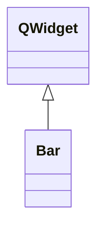

# Bar

**Namespace:** `DISPLIB` &nbsp;·&nbsp; **Library:** Display Library

`#include <disp/bar.h>`

```cpp
class DISPLIB::Bar
```

[`Bar`](/docs/api/disp/bar) chart / histogram QWidget rendering Eigen class-limit + frequency vectors with QPainter.

Templated on the value type so callers can pass either integer or floating bin limits. Use `setData` to install a new dataset and `updatePlot` to refresh an existing chart in place; both call `splitCoefficientAndExponent` internally to format the tick labels with a configurable number of significant digits.

```cpp title="src/examples/ex_disp_plots/main.cpp"
Bar bar("Amplitude histogram");
VectorXd classLimits(5); // class edges
classLimits << 0.0, 1.0, 2.0, 3.0, 4.0;
VectorXi counts(4); // counts per class
counts << 5, 20, 10, 15;
bar.setData(classLimits, counts, 2); // 2 digits on the axis labels
```

### Inheritance



---

## Public Methods

### Bar(title, parent)

The constructor for [`Bar`](/docs/api/disp/bar).

**Parameters:**

- **title** : *const QString &*
  Title drawn above the bar chart (default empty).

- **parent** : *QWidget **
  Parent widget (default nullptr).

---

### setData(matClassLimitData, matClassFrequencyData, iPrecisionValue)

Sets new data to the bar chart.

**Parameters:**

- **matClassLimitData** : *const Eigen::Matrix&lt; T, Eigen::Dynamic, 1 &gt; &*
  vector input filled with class limits.

- **matClassFrequencyData** : *const Eigen::Matrix&lt; int, Eigen::Dynamic, 1 &gt; &*
  vector input filled with class frequency to the corresponding class.

- **iPrecisionValue** : *int*
  user input to determine the amount of digits of coefficient shown in the histogram.

---

### setData(matClassLimitData, matClassFrequencyData, iPrecisionValue)

---

### updatePlot(matClassLimitData, matClassFrequencyData, iPrecisionValue)

Updates the bar plot with the new data.

**Parameters:**

- **matClassLimitData** : *const Eigen::Matrix&lt; T, Eigen::Dynamic, Eigen::Dynamic &gt; &*
  vector input filled with class limits.

- **matClassFrequencyData** : *const Eigen::Matrix&lt; int, Eigen::Dynamic, Eigen::Dynamic &gt; &*
  vector input filled with class frequency to the corresponding class.

- **iPrecisionValue** : *int*
  user input to determine the amount of digits of coefficient shown in the histogram.

---

### splitCoefficientAndExponent(matClassLimitData, iClassAmount, vecCoefficientResults, vecExponentValues)

splitCoefficientAndExponent takes in QVector value of coefficient and exponent and normalizes them.

**Parameters:**

- **matClassLimitData** : *const Eigen::Matrix&lt; T, Eigen::Dynamic, Eigen::Dynamic &gt; &*
  vector input filled with values of class limits.

- **iClassAmount** : *int*
  amount of classes in the histogram.

- **vecCoefficientResults** : *Eigen::VectorXd &*
  vector filled with values of coefficient only.

- **vecExponentValues** : *Eigen::VectorXi &*
  vector filled with values of exponent only.

---

## Example

- Full source: [`src/examples/ex_disp_plots/main.cpp`](https://github.com/mne-tools/mne-cpp/tree/staging/src/examples/ex_disp_plots/main.cpp)
- Build target: `ex_disp_plots` (runs under CTest)

## Authors of this file

- Lorenz Esch &lt;lorenz.esch@tu-ilmenau.de&gt;
- Juan GPC &lt;jgarciaprieto@mgh.harvard.edu&gt;
- Andreas Griesshammer &lt;ag@fieldlineinc.com&gt;
- Gabriel Motta &lt;gabrielbenmotta@gmail.com&gt;
- Christoph Dinh &lt;christoph.dinh@mne-cpp.org&gt;
