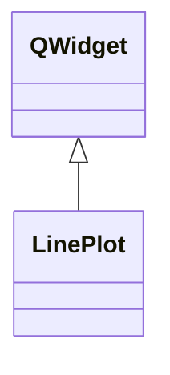

# LinePlot

**Namespace:** `DISPLIB` &nbsp;·&nbsp; **Library:** Display Library

`#include <disp/lineplot.h>`

```cpp
class DISPLIB::LinePlot
```

Simple x / y line-series QWidget rendered with QPainter (no Qt Charts dependency).

Supports multiple series, a settable title and x / y labels and auto-ranging axes. Series are stored as `QVector<double>` pairs and re-drawn during `paintEvent`.

```cpp title="src/examples/ex_disp_plots/main.cpp"
QVector<double> x;
QVector<double> y;
for (int i = 0; i <= 100; ++i) {
    x.append(i / 100.0);
    y.append(std::sin(2.0 * M_PI * x.last()));
}
LinePlot line(x, y, "sin(2 pi t)");
line.setXLabel("t [s]");
line.setYLabel("amplitude");
```

### Inheritance



---

## Public Methods

### LinePlot(parent)

Constructs a line series plot.

**Parameters:**

- **parent** : *QWidget **
  If parent is nullptr, the new widget becomes a window.

---

### LinePlot(y, title, parent)

Constructs a line series plot.

**Parameters:**

- **y** : *const QVector&lt; double &gt; &*
  The double data vector.

- **title** : *const QString &*
  [`Plot`](/docs/api/disp/plot) title.

- **parent** : *QWidget **
  If parent is nullptr, the new widget becomes a window.

---

### LinePlot(x, y, title, parent)

Constructs a line series plot.

**Parameters:**

- **x** : *const QVector&lt; double &gt; &*
  X-Axis data to plot.

- **y** : *const QVector&lt; double &gt; &*
  Y-Axis data to plot.

- **title** : *const QString &*
  [`Plot`](/docs/api/disp/plot) title.

- **parent** : *QWidget **
  If parent is nullptr, the new widget becomes a window.

---

### ~LinePlot()

Destructs the line series plot.

---

### setTitle(p_sTitle)

Sets the plot title.

**Parameters:**

- **p_sTitle** : *const QString &*
  The title.

---

### setXLabel(p_sXLabel)

Sets the label of the x axis.

**Parameters:**

- **p_sXLabel** : *const QString &*
  The x axis label.

---

### setYLabel(p_sYLabel)

Sets the label of the y axis.

**Parameters:**

- **p_sYLabel** : *const QString &*
  The y axis label.

---

### updateData(y)

Updates the plot using a given double vector without given X data.

**Parameters:**

- **y** : *const QVector&lt; double &gt; &*
  The double data vector.

---

### updateData(x, y)

Updates the plot using the given vectors.

**Parameters:**

- **x** : *const QVector&lt; double &gt; &*
  X-Axis data to plot.

- **y** : *const QVector&lt; double &gt; &*
  Y-Axis data to plot.

---

## Example

- Full source: [`src/examples/ex_disp_plots/main.cpp`](https://github.com/mne-tools/mne-cpp/tree/staging/src/examples/ex_disp_plots/main.cpp)
- Build target: `ex_disp_plots` (runs under CTest)

## Authors of this file

- Lorenz Esch &lt;lorenz.esch@tu-ilmenau.de&gt;
- Juan GPC &lt;jgarciaprieto@mgh.harvard.edu&gt;
- Andreas Griesshammer &lt;ag@fieldlineinc.com&gt;
- Gabriel Motta &lt;gabrielbenmotta@gmail.com&gt;
- Christoph Dinh &lt;christoph.dinh@mne-cpp.org&gt;
