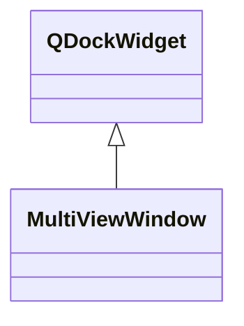

# MultiViewWindow

**Namespace:** `DISPLIB` &nbsp;·&nbsp; **Library:** Display Library

`#include <disp/multiviewwindow.h>`

```cpp
class DISPLIB::MultiViewWindow
```

QDockWidget wrapper used as the building block of [`MultiView`](/docs/api/disp/multi-view) layouts.

Stores the wrapped widget plus a stable name / floating flag so [`MultiView`](/docs/api/disp/multi-view) can re-arrange, retab and persist the dock layout consistently.

### Inheritance



---

## Public Methods

### MultiViewWindow(parent, flags)

Constructs an [`MultiViewWindow`](/docs/api/disp/multi-view-window).

---

### ~MultiViewWindow()

Destructs an [`MultiViewWindow`](/docs/api/disp/multi-view-window).

---

## Authors of this file

- Lorenz Esch &lt;lorenz.esch@tu-ilmenau.de&gt;
- Gabriel Motta &lt;gabrielbenmotta@gmail.com&gt;
- Christoph Dinh &lt;christoph.dinh@mne-cpp.org&gt;
