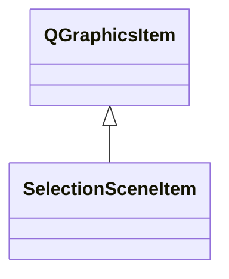

# SelectionSceneItem

**Namespace:** `DISPLIB` &nbsp;·&nbsp; **Library:** Display Library

`#include <disp/selectionsceneitem.h>`

```cpp
class DISPLIB::SelectionSceneItem
```

Graphics item representing a selectable electrode or channel in a 2-D layout scene.

### Inheritance



---

## Public Methods

### SelectionSceneItem(channelName, channelNumber, channelPosition, channelKind, channelUnit, channelColor, bIsBadChannel)

Constructs a [`SelectionSceneItem`](/docs/api/disp/selection-scene-item).

**Parameters:**

- **channelName** : *QString*
  Name of the channel shown by this item.

- **channelNumber** : *int*
  Index of the channel in the measurement info.

- **channelPosition** : *QPointF*
  2-D layout position (scaled by 10 when painted).

- **channelKind** : *int*
  FIFF channel kind (e.g. FIFFV_MEG_CH).

- **channelUnit** : *int*
  FIFF unit of the channel data.

- **channelColor** : *QColor*
  Fill colour of the electrode marker (default Qt::blue).

- **bIsBadChannel** : *bool*
  True to paint the channel as bad (red) (default false).

---

### boundingRect()

Returns the bounding rect of the electrode item.

This rect describes the area which the item uses to plot in.

**Returns:**

- *QRectF* — Fixed 50 x 50 rectangle with top-left corner at (-25, -30) in item coordinates.

---

### paint(painter, option, widget)

Reimplemented paint function.

**Parameters:**

- **painter** : *QPainter **
  Painter used to draw the electrode marker and label.

- **option** : *const QStyleOptionGraphicsItem **
  Style options (unused).

- **widget** : *QWidget **
  Widget being painted on (unused).

---

## Authors of this file

- Lorenz Esch &lt;lorenz.esch@tu-ilmenau.de&gt;
- Gabriel Motta &lt;gabrielbenmotta@gmail.com&gt;
- Juan GPC &lt;jgarciaprieto@mgh.harvard.edu&gt;
- Christoph Dinh &lt;christoph.dinh@mne-cpp.org&gt;
