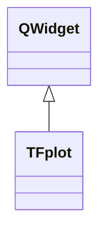

# TFplot

**Namespace:** `DISPLIB` &nbsp;·&nbsp; **Library:** Display Library

`#include <disp/tfplot.h>`

```cpp
class DISPLIB::TFplot
```

Time-frequency spectrogram QWidget rendering an Eigen matrix as a colour image.

Two constructors accept either a full or a frequency-cropped `MatrixXd` spectrogram together with a sample rate and a `DISPLIB::ColorMaps` "ColorMaps" enum entry; ``calc_plot()`` builds the cached `QImage` that subsequent `paintEvents` draw.

```cpp title="src/examples/ex_disp_plots/main.cpp"
MatrixXd tf = MatrixXd::Zero(50, 40);   // frequency rows x time columns
tf.middleRows(20, 10).setConstant(1.0); // 20-30 Hz band at 100 Hz sampling
TFplot tfPlot(tf, 100.0, 0.0, 50.0, Jet);
```

### Inheritance



---

## Public Methods

### TFplot(tf_matrix, sample_rate, lower_frq, upper_frq, cmap)

Constructs [`TFplot`](/docs/api/disp/t-fplot) class.

**Parameters:**

- **tf_matrix** : *Eigen::MatrixXd*
  given spectrogram.

- **sample_rate** : *qreal*
  given sample rate of signal related to th spectrogram.

- **lower_frq** : *qreal*
  lower bound frequency, that should be plotted.

- **upper_frq** : *qreal*
  upper bound frequency, that should be plotted.

- **cmap** : *ColorMaps*
  colormap used to plot the spectrogram.

---

### TFplot(tf_matrix, sample_rate, cmap)

Constructs [`TFplot`](/docs/api/disp/t-fplot) class.

**Parameters:**

- **tf_matrix** : *Eigen::MatrixXd*
  given spectrogram.

- **sample_rate** : *qreal*
  given sample rate of signal related to th spectrogram.

- **cmap** : *ColorMaps*
  colormap used to plot the spectrogram.

---

## Example

- Full source: [`src/examples/ex_disp_plots/main.cpp`](https://github.com/mne-tools/mne-cpp/tree/staging/src/examples/ex_disp_plots/main.cpp)
- Build target: `ex_disp_plots` (runs under CTest)

## Authors of this file

- Lorenz Esch &lt;lorenz.esch@tu-ilmenau.de&gt;
- Juan GPC &lt;jgarciaprieto@mgh.harvard.edu&gt;
- Gabriel Motta &lt;gabrielbenmotta@gmail.com&gt;
- Christoph Dinh &lt;christoph.dinh@mne-cpp.org&gt;
